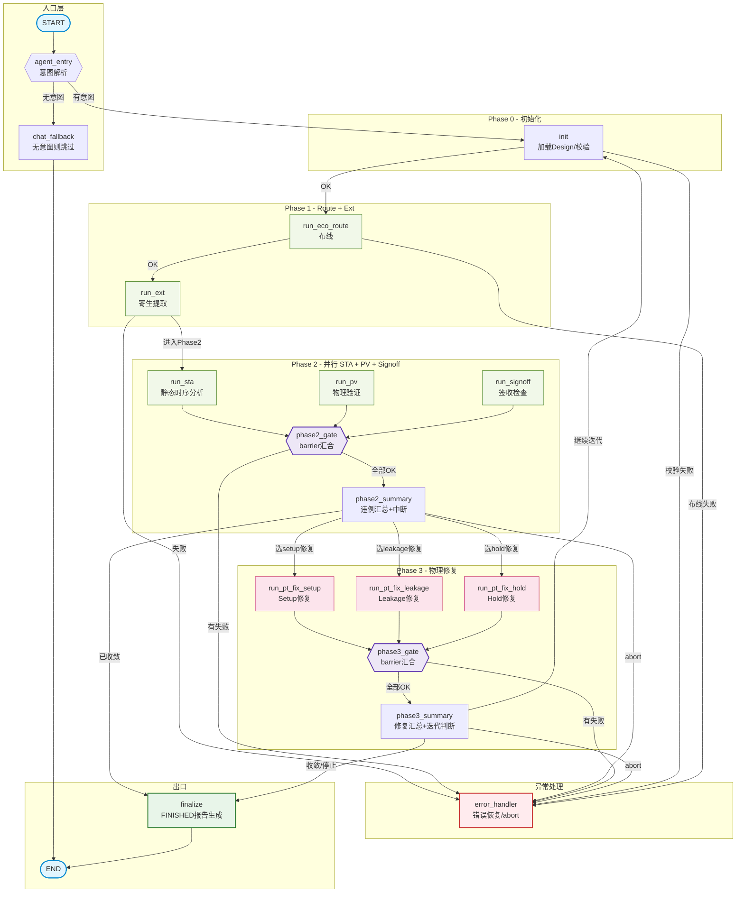

# 基于LangGraph的ECO固定流水线详细设计方案

## 一、方案定位与设计目标

### 1.1 核心定位

本方案为**ECO Agent三步演进架构·阶段一核心落地设计**，采用LangGraph实现**确定性、可复现、可断点续跑、人机协同的固定ECO流水线**。

摒弃LLM驱动流程流转的不确定性，所有Phase/Step执行顺序、串行/并行/分支逻辑、循环规则均为硬编码确定性控制流；LLM仅承担顶层自然语言参数解析、断点信息润色展示，**不参与流程调度与节点跳转决策**。

### 1.2 设计目标

- **彻底解决ClaudeCode长任务痛点**：解决上下文超限、长任务遗忘、流程中断丢失进度、日志冗余污染对话上下文问题
- **百分百工程确定性**：ECO标准流程强约束，Phase/Step执行顺序固定、结果可复现，适配数字后端EDA严谨交付要求
- **原生人机在环（HITL）**：三处关键节点可控暂停（Phase2修复策略决策、Phase3迭代终止决策、错误处理），适配工程师ECO调试决策习惯
- **状态持久化可恢复**：全程Checkpoint快照，支持程序重启、异常崩溃后断点续跑
- **底座完全可复用**：所有原子Step节点、MCP API、状态结构可无缝演进至阶段二Coordinator动态规划、阶段三多Agent集群架构，无需推翻重写

### 1.3 适用场景

标准时序ECO迭代修复、Setup/Hold违例收敛、多轮迭代闭环、人工策略干预的量产ECO调试场景。

***

## 二、整体架构与设计约束

### 2.1 架构总览：调用层 + LangGraph 图（两层）

本方案采用 LangGraph 原生开发范式，架构简化为两层：**调用层（薄壳）** + **LangGraph 图（一张图包含全部业务逻辑）**。架构设计中的分层约束（LLM 不决策、日志落磁盘）转化为编码纪律，而非独立架构层。

#### 两层架构图

```
┌─────────────────────────────────────────────────────────┐
│  调用层（薄壳，几十行代码，独立于 LangGraph 图）          │
│                                                         │
│  职责：                                                  │
│  1. 驱动图执行（graph.stream / graph.get_state）         │
│  2. 格式化展示节点事件和中断信息                           │
│  3. 捕获 interrupt 事件，暂停、接收用户输入                │
│  4. 根据中断类型 + 用户输入，构建 Command 恢复执行          │
│  5. 管理 thread_id 生命周期（启动 / 断点续跑）              │
│                                                         │
│  后续重构为 Typer CLI 时，本层直接替换，                  │
│  LangGraph 图代码一行不动                                 │
└──────────────────┬──────────────────────────────────────┘
                   │ stream / get_state / Command
┌──────────────────▼──────────────────────────────────────┐
│  LangGraph 图（一张图，含两条路径）                        │
│                                                         │
│  ┌─ 对话路径（LLM 驱动）─────────────────────────────┐   │
│  │ agent 节点（调 LLM）                               │   │
│  │   → 条件边：有 tool_calls → tools 节点 → 回到 agent  │   │
│  │              无 tool_calls → 结束                   │   │
│  └───────────────────────────────────────────────────┘   │
│                                                         │
│  ┌─ ECO 固定路径（硬编码流转，LLM 绝对碰不到）─────────┐  │
│  │                                                     │  │
│  │  Init（参数解析+目录创建+输入校验+状态初始化）        │  │
│  │    │                                                │  │
│  │    ▼                                                │  │
│  │  Phase1（串行 step）:                                │  │
│  │    run_eco_route → run_ext                          │  │
│  │    │                                                │  │
│  │    ▼                                                │  │
│  │  Phase2（并行 step，Send 同时发三个节点）:            │  │
│  │    ┌→ run_sta        │                              │  │
│  │    ├→ run_pv         │ 全部完成后 → phase2_summary   │  │
│  │    └→ run_signoff    │   ├─ 正常 → interrupt(中断1) │  │
│  │                         └─ 异常 → Error Handler      │  │
│  │                                                     │  │
│  │  Phase3（分支 step，根据修复策略选一种执行）:         │  │
│  │    interrupt 恢复后，用户输入 setup → run_pt_fix_setup   │  │
│  │                       用户输入 hold  → run_pt_fix_hold   │  │
│  │    → phase3_summary → interrupt(中断2)               │  │
│  │                                                     │  │
│  │  迭代决策:                                           │  │
│  │    continue → Init（新一轮迭代）                      │  │
│  │    stop / Error Handler abort → Finalize → END       │  │
│  └───────────────────────────────────────────────────┘   │
│                                                         │
│  ┌─ 分流条件边 ──────────────────────────────────────┐   │
│  │ agent 节点执行完 → 判断用户输入是普通对话还是 ECO   │   │
│  │   → 普通对话 → 走对话路径（tools → agent 循环）     │   │
│  │   → ECO 任务 → 走 ECO 固定路径                      │   │
│  └───────────────────────────────────────────────────┘   │
│                                                         │
│  图内组件：                                               │
│  - State：自定义 ECOState（含 messages + ECO 专用字段）     │
│  - 节点：Init、Step级节点(run_*)、汇总节点(*_summary)、   │
│  │        Error Handler、Finalize                         │
│  - 条件边：done/error 分流、continue/stop 分流、          │
│  │        Phase2 并行 Send、Phase3 分支路由                │
│  - interrupt/resume：三种中断（策略决策、迭代决策、错误处理）│
│  - Checkpoint：SqliteSaver（生产）/ MemorySaver（调试）    │
│  - 节点内部调用：LLM（参数解析/状态润色）、MCP API（EDA） │
└─────────────────────────────────────────────────────────┘
```

#### 关键澄清：不是两张图，是一张图 + 条件分流

对话路径和 ECO 固定路径是**同一张 LangGraph 图中的两条执行路径**，由条件边根据用户输入分流决定走哪条。两条路径**不会并行执行**：

- 用户输入普通问题 → 走对话路径（LLM 驱动）
- 用户输入 ECO 任务 → 走 ECO 固定路径（硬编码流转）
- 图执行时只有一条路径在跑，不存在"对话图在 ECO 图执行时做什么"的问题

#### LLM 和 MCP 在架构中的归属

方案中"轻量 LLM 翻译层"和"MCP + EDA 执行层"并非独立架构层，而是**LangGraph 节点内部的调用**：

| 方案"层"         | 实际归属             | 说明                                                                       |
| ------------- | ---------------- | ------------------------------------------------------------------------ |
| 轻量 LLM 翻译层    | LangGraph 节点内部调用 | Init 节点内调 LLM 解析参数、中断前调 LLM 润色状态。LLM 输出为确定的 JSON/文本，不返回条件判断              |
| MCP + EDA 执行层 | LangGraph 节点内部调用 | **每个 Step 节点**内部调用对应的 MCP step 粒度 API，返回结构化摘要。原始 EDA 日志在节点内部落磁盘，不进 State |

### 2.2 业务三层 → 控制流/执行流分工

业务专家描述的三层流程是**控制流**，必须全交给 LangGraph 管理。MCP API 是**执行流**，定在"不可再分的 EDA 原子操作"（Step 粒度）。两个层的粒度**不需要对齐**。

| 业务层级                                                                        | 本质  | 谁来管            | 实现方式                                                                                  |
| --------------------------------------------------------------------------- | --- | -------------- | ------------------------------------------------------------------------------------- |
| **顶层 Iteration 循环**（iteration1 → iteration2 → ...）                          | 控制流 | LangGraph 条件边  | `route_after_phase3_summary` 根据 `user_iter_choice` 路由，continue → Init，stop → Finalize |
| **中层 Phase 流转**（Phase1 串行 / Phase2 并行 / Phase3 分支）                          | 控制流 | LangGraph 节点拓扑 | Phase1 串行用 `add_edge`；Phase2 并行用 `Send` API；Phase3 分支用 `add_conditional_edges`        |
| **底层 Step 执行**（ecoRoute → Ext / STA ‖ PV ‖ Signoff / FixSetup ‖ FixHold 分支） | 执行流 | MCP API        | 每个 Step 对应一个 MCP API（`run_eco_route`、`run_sta`...），只做"执行 EDA 工具 → 提取摘要 → 返回结构化数据"     |

#### 为什么 MCP API 不能定在 Phase 粒度

| 反模式                    | 问题                                                              |
| ---------------------- | --------------------------------------------------------------- |
| MCP 自己实现 Phase2 并行     | MCP 要开多线程/多进程，还要处理 STA 失败但 PV 成功的部分失败场景——这完全是 LangGraph 的活      |
| MCP 自己实现 Phase3 分支     | MCP 内部根据策略选 FixXxx，LangGraph 的 Error Handler 捕获不到异常（因为被 MCP 吞了） |
| MCP API 签名随 Phase 内部变化 | Phase2 加 DRC → 改 MCP 签名；Phase3 加 FixTiming → 改签名。稳定性差           |

**核心原则**：MCP 只做原子执行，不做流程控制。串行/并行/分支全是 LangGraph 的事。

### 2.3 核心编码纪律（关键约束）

分层约束的设计意图转化为以下**编码纪律**，贯穿所有节点实现：

- 所有**原始 EDA 日志、完整 STA/PV 报告**在 LangGraph 节点内部落磁盘，**永不存入 State、永不传入 LLM**
- 仅将结构化摘要、关键指标、状态标记写入 State，从根源杜绝 Token 爆炸、上下文超限
- **流程流转 100% 由硬编码条件边控制**：
  - Phase1 串行：普通边连接
  - Phase2 并行：`Send` API 同时发送
  - Phase3 分支：条件边根据 `user_fix_strategy` 路由
  - done/error 分流、continue/stop 分流：条件边判断逻辑硬编码
  - LLM 无权跳过、调换、新增执行节点，LLM 的输出不参与任何条件边判断
- **MCP API 定在 Step 粒度**（不可再分的 EDA 原子操作），MCP 只做"执行 EDA 工具 → 提取摘要 → 返回结构化数据"，绝对不做流程控制（串行/并行/分支/循环）
- 所有中断、暂停、恢复、迭代逻辑由 LangGraph 原生 `interrupt()` + Checkpoint 机制实现，无人工临时状态维护
- **图节点内禁止** **`input()`**：节点保持纯函数式（输入 State → 输出 State 更新），交互逻辑全部在调用层实现。这样图可序列化、可持久化、可移植（本地终端 / 服务器 / LangGraph Studio）
- **State 不可变（Immutable Between Nodes）**：节点内**禁止 mutate State 对象**（如 `state["field"] = value`），必须返回新的 State 更新字典（如 `return {"field": new_value}` 或展开式 `return {**state, "field": new_value}`）。LangGraph 自动合并节点返回的更新到 State 中，手动 mutate 会导致 Checkpoint 快照丢失中间变化、调试困难
- **interrupt() 必须放在节点逻辑最末端**：因为 `interrupt()` 恢复时会 rerun 该节点前半段代码，所有 MCP 调用、State 更新、副作用操作必须在 interrupt() 之前完成。详见 5.1 节"interrupt() 会 rerun 节点前半段"语义说明

### 2.4 架构选择：一张图分流 vs 嵌套式

业界有两种主流架构实现"对话 + 固定流水线"共存：

| 方案               | 描述                                                    | 优点                                     | 缺点                               |
| ---------------- | ----------------------------------------------------- | -------------------------------------- | -------------------------------- |
| **一张图条件分流**（本方案） | 对话路径和 ECO 固定路径是同一张图的两条执行路径，由条件边分流                     | 简单直接、调试方便、所有节点共享同一个 State 和 Checkpoint | 图会变复杂（节点多了之后）                    |
| **嵌套式架构**        | 外层 ReAct 对话 Agent（LLM 驱动），内层把 ECO 固定流程图封装成 Tool，让外层调用 | 更符合 LangGraph 设计哲学（Tool 抽象）、内外层完全隔离    | 原型阶段过度设计、Tool 的输入输出 schema 要额外维护 |

**本方案选择一张图分流**的理由：原型阶段固定流水线节点数不多（Init + 6 个 Step 节点 + 2 个汇总节点 + Error + Finalize = 11 个），一张图足够清晰。后续如果节点数膨胀到 20+ 或固定流水线逻辑独立成产品，可以平滑重构为嵌套式——内层固定流程图直接编译为一个 Tool 即可，**ECO 固定路径的节点代码一行不动**。

### 2.5 LangGraph 完整拓扑图

下图由 `scripts/draw_graph.py` 从 `graph_builder.py` 构建的 Pregel 对象自动提取节点、静态边和条件分支渲染而成，与运行时实际拓扑**一致**（不是手绘示意图）。

- **绿色节点**：Phase 1/2 普通步骤（EDA 工具原子操作）
- **粉色节点**：Phase 3 修复步骤（Setup/Hold/Leakage 三类修复策略）
- **紫色菱形**：Barrier 汇合门（phase2_gate / phase3_gate）——多并行分支全部完成后才放行
- **橙色矩形**：各 Phase 的 Summary 节点（汇总违例 + 触发 interrupt 等待用户决策）
- **红色节点**：error_handler（所有 Phase 共享的异常出口）
- **粗蓝框**：START / END；**粗绿框**：finalize（生成 FINISHED 报告）
- **实线（无标签）**：静态边 `add_edge`；**带标签虚线**：条件分支 `add_conditional_edges`，标签即路由函数返回值



> **刷新方式**：代码拓扑变更后，运行 `PYTHONPATH=. python scripts/draw_graph.py` 即可重新生成 HTML 预览；上方 Mermaid 源码也会随 `scripts/draw_graph.py` 一起从 builder 提取，无需手绘。

***

## 三、LangGraph State状态结构体详细设计

State为全局唯一数据源，保存所有流程进度、任务参数、违例数据、人机交互信息，全程自动快照持久化。

### 3.1 完整State字段定义（18 个）

State 字段遵循**分类原则**：只有图的条件边/路由函数需要读它来决定走向、或调用层中断恢复时需要写入的人机交互数据，才放 State。EDA 详细执行数据（WNS/TNS/各场景分解）、报告文件路径、集群队列等基础设施参数**不放 State**——详细数据在 EDA 工具内部解析后打日志或写磁盘，路径和基础设施参数在 Config 中定义。State/Config/磁盘三者分工详见 3.2 节。

| 字段名                 | 类型   | 用途说明                                                                | 谁写                                                                             | 谁读                                                 |
| ------------------- | ---- | ------------------------------------------------------------------- | ------------------------------------------------------------------------------ | -------------------------------------------------- |
| design\_name        | str  | 当前迭代的 Design 名称，任务唯一标识                                              | Init                                                                           | 所有 MCP API 调用时作为参数传入                               |
| run\_dir            | str  | 本轮运行目录完整路径，MCP API 执行 EDA 工具的工作目录                                   | Init（Config.path\_templates.base\_run\_dir + design\_name + iteration\_cnt 算出） | 所有 MCP API、Error Handler、Finalize                  |
| iteration\_cnt      | int  | 当前 ECO 迭代轮次，从 1 开始自增                                                | Init（首轮=1）、phase3\_summary（continue 分支）                                        | Init 下一轮、Finalize 报告                               |
| setup\_vio          | int  | 当前轮次 Setup 违例数量（摘要值）                                                | run\_sta（从 MCP 返回提取）                                                           | phase2\_summary（中断1 展示对比）、phase3\_summary、Finalize |
| hold\_vio           | int  | 当前轮次 Hold 违例数量（摘要值）                                                 | run\_sta（同上）                                                                   | 同上                                                 |
| pv\_pass            | bool | PV Signoff 校验是否通过                                                   | run\_pv                                                                        | phase2\_summary（中断1 展示门禁结果）、Finalize               |
| signoff\_pass       | bool | Signoff 合规检查是否通过                                                    | run\_signoff                                                                   | 同上                                                 |
| prev\_setup\_vio    | int  | 上一轮 Setup 违例数，中断1 做修复前后对比用                                          | phase2\_summary（成功路径才写，首轮 Init 初始化为 0）                                         | phase2\_summary 下一轮读                               |
| prev\_hold\_vio     | int  | 上一轮 Hold 违例数，同上                                                     | 同上                                                                             | 同上                                                 |
| interrupt\_msg      | str  | 断点展示给用户的提示文本、报告摘要、决策提问                                              | phase2\_summary / phase3\_summary / error\_handler                             | 调用层（format\_interrupt 展示给用户）                       |
| user\_fix\_strategy | str  | 中断1 用户选择的修复策略：setup / hold                                          | **调用层**（Command resume 后写入）                                                    | phase2\_summary 条件边路由函数                            |
| user\_iter\_choice  | str  | 中断2 用户选择的迭代决策：continue / stop                                       | **调用层**（同上）                                                                    | phase3\_summary 条件边路由函数                            |
| phase\_status       | dict | 各 Phase 完成状态：`{"phase1": "done", "phase2": "running"/"error", ...}` | `_run_step`（正常/异常路径）                                                           | 路由函数、Error Handler 找 error 对应 Phase                |
| step\_status        | dict | 各 Step 完成状态：`{"run_eco_route": "done", "run_sta": "error", ...}`    | `_run_step`（正常/异常路径）                                                           | Error Handler 找 error 对应 Step                      |
| current\_phase      | str  | 当前正在执行的 Phase（phase1/phase2/phase3）或 "error\_handler"               | `_run_step`（正常/异常）、Error Handler（设为 "error\_handler"）                          | 调用层判断中断类型、Error Handler                            |
| current\_step       | str  | 当前正在执行的 Step 标识（run\_eco\_route/run\_sta/...）                       | `_run_step`（正常/异常）                                                             | Error Handler、日志追踪                                 |
| error\_msg          | str  | 最近一次错误的摘要信息（异常类型+关键片段）                                              | `_run_step`（异常路径）                                                              | Error Handler 展示、调用层                               |
| messages            | list | 对话历史（继承自 LangGraph MessagesState）                                   | LangGraph 自动 append                                                            | agent 节点（LLM 喂历史）                                  |

### 3.2 State / Config / 磁盘 三者分工

| 存储域        | 生命周期                        | 变化频率      | 核心判断标准                                          | 典型内容                                                                                                                                          |
| ---------- | --------------------------- | --------- | ----------------------------------------------- | --------------------------------------------------------------------------------------------------------------------------------------------- |
| **State**  | 单次图执行（一个 thread\_id 一个生命周期） | 每个节点都可能变  | 图的条件边/路由函数**需要读它来决定走向**，或调用层中断恢复**需要写用户输入**     | design\_name、run\_dir、iteration\_cnt、setup\_vio、hold\_vio、phase\_status、step\_status、current\_phase、error\_msg、prev\_*、interrupt\_msg、user\_* |
| **Config** | 整个项目周期                      | 几乎不变      | MCP Server 内部调 EDA 工具**需要知道但运行时不变**的东西；图路由逻辑不依赖 | 集群队列名、EDA 工具路径、Step 超时时间、日志/报告路径模板、wait\_flag 规则、base\_run\_dir 模板                                                                            |
| **磁盘**     | run\_dir 目录内                | EDA 执行时产生 | EDA 工具**自然产生的执行产物**，不需要进 State                  | STA 完整报告、PV 报告、Route/Ext 详细日志、Fix 详细日志、wait\_flag 文件                                                                                          |

**State 不存路径字段的理由**：Error Handler 和 Finalize 需要日志/报告路径时，用 `f-string` 从 `Config.path_templates.{step}_log.format(run_dir=state["run_dir"])` 动态拼接即可。不在 State 里预存路径，避免"State 里存的路径字符串"和"Config 里的路径模板"两套定义不一致。

***

## 四、LangGraph 节点详细设计（Step 粒度）

### 4.1 Init 初始化节点

#### 节点职责

流水线启动后的**首个执行节点**，完成所有前置准备工作，确保 ECO 流水线在正确的环境和输入数据下启动。任何初始化校验失败均终止流水线并告知用户。

#### 内部执行逻辑

1. **参数解析与确认**
   - 顶层 LLM 翻译层从用户自然语言指令中提取 `design_name`（必填）
   - 校验必填参数完整性，缺失则追问用户补充
   - 若为断点续跑场景，直接从 Checkpoint 恢复 State 中的参数，跳过本轮参数解析
2. **工作目录创建与校验**
   - 基于 `design_name` + `iteration_cnt` 确定本轮运行目录 `run_dir`
   - 创建目录（若不存在），校验目录读写权限
   - 断点续跑时需恢复上次运行目录
3. **输入数据合法性校验**
   - 校验网表文件（netlist）是否存在、格式是否合法
   - 校验 SDC 约束文件、时序约束文件是否完整
   - 校验设计数据库路径是否可访问
   - 校验 EDA 工具链环境变量、license 有效性
4. **断点恢复检测**
   - 根据 config 会话 ID 查询 SqliteSaver 中是否存在历史快照
   - 若存在（说明是断点续跑场景），LangGraph 会在 `graph.stream()` 时**自动恢复 State 到上次中断位置**，Init 节点只需正常执行参数校验和目录检查即可，**不需要做任何跳转**
   - 若不存在（首次启动），正常走初始化流程
5. **Phase/Step 状态初始化**
   - 设置 `current_phase = "init"`
   - 重置 `phase_status = {"init": "done", "phase1": "pending", "phase2": "pending", "phase3": "pending"}`
   - 重置 `step_status = {}`（所有 Step 状态清空，首轮执行才开始填充）
   - 首轮迭代时将 `prev_setup_vio`、`prev_hold_vio` 初始化为 0
6. 根据校验结果决定流转：
   - **全部校验通过** → phase\_status\["init"] = "done"，条件边路由至 `run_eco_route`
   - **有校验失败**（如 netlist 不存在、EDA license 失效、目录权限不足）→ 设置 `step_status["init"] = "error"` + `phase_status["init"] = "error"` + `current_step = "init"` + `current_phase = "init"` + `error_msg`，条件边路由至 Error Handler

#### 输出更新字段

current\_phase、run\_dir、phase\_status、step\_status、prev\_setup\_vio、prev\_hold\_vio

***

### 4.2 Phase1 Step 级节点（串行：ecoRoute → Extraction）

Phase1 包含两个串行执行的 Step 节点，用普通边硬编码串行关系。

#### Step 1：node\_run\_eco\_route

**职责**：调用 MCP API `run_eco_route` 完成 ECO Route 初始化（网表解析、设计数据库准备、ECO 布线初始化）。

**内部逻辑**：使用统一辅助函数 `_run_step`（见 4.5 节）执行：

```python
def node_run_eco_route(state: ECOState):
    return _run_step(state, "run_eco_route", "phase1")
```

**输出更新字段**：step\_status\["run\_eco\_route"]、phase\_status\["phase1"]（done/error）

#### Step 2：node\_run\_ext

**职责**：调用 MCP API `run_ext` 完成寄生参数提取，为 Phase2 STA 提供基础设计数据。

**内部逻辑**：

```python
def node_run_ext(state: ECOState):
    return _run_step(state, "run_ext", "phase1")
```

**输出更新字段**：step\_status\["run\_ext"]、phase\_status\["phase1"]

#### Phase1 错误流转

每个 Step 内部 try-except 执行 MCP API，异常时设置 `step_status[step_name] = "error"` + `phase_status["phase1"] = "error"` + `error_msg`，节点 return 后由条件边路由至 Error Handler。

***

### 4.3 Phase2 Step 级节点（并行：STA ‖ PV ‖ Signoff + 汇总节点）

Phase2 包含三个**并行**执行的 Step 节点（用 `Send` API 同时发送），全部完成后流转至汇总节点 `node_phase2_summary`（触发中断1）。

#### 三个并行 Step 节点

**node\_run\_sta**：调用 MCP API `run_sta`，返回 setup/hold 违例数和报告路径

```python
def node_run_sta(state: ECOState):
    return _run_step(state, "run_sta", "phase2",
                     result_keys=["setup_vio", "hold_vio"])
```

**node\_run\_pv**：调用 MCP API `run_pv`，返回 PV 通过/失败和报告路径

```python
def node_run_pv(state: ECOState):
    return _run_step(state, "run_pv", "phase2",
                     result_keys=["pv_pass"])
```

**node\_run\_signoff**：调用 MCP API `run_signoff`，返回 Signoff 检查结果

```python
def node_run_signoff(state: ECOState):
    return _run_step(state, "run_signoff", "phase2",
                     result_keys=["signoff_pass"])
```

#### 并行触发（LangGraph Send API）

Phase1 最后一个 Step（`run_ext`）执行完后，条件边用 `Send` API 同时发送三个节点：

```python
def route_after_phase1(state: ECOState):
    if state["step_status"].get("run_ext") == "error":
        return "error_handler"
    # 正常：同时发送三个并行节点
    return [
        Send("run_sta", state),
        Send("run_pv", state),
        Send("run_signoff", state),
    ]
```

三个并行节点**全部执行完毕后**（全部 done 或 error），LangGraph 自动聚合 State 更新（自动 merge），流转至 `node_phase2_summary`。

#### node\_phase2\_summary（Phase2 汇总 + 中断1）

**职责**：汇总三个并行 Step 的执行结果，检查是否全部成功，构建中断1的展示内容，触发 interrupt 等待用户输入修复策略。

**内部逻辑**：

1. 检查三个 Step 是否全部成功：
   - 有任意一个 `step_status[step_name] == "error"` → 构造错误信息，由条件边路由至 Error Handler
   - 全部 done → 继续
2. **生成修复前后对比**：
   - 从 State 读取当前轮 `setup_vio` / `hold_vio`（三个 Step 自动合并写入）
   - 与 `prev_setup_vio` / `prev_hold_vio` 做差值对比，展示收敛情况
   - 首轮迭代无上一轮数据则标注"首轮迭代，无历史对比"
3. **构建中断1展示内容**（interrupt\_msg）：

```
── Phase2 完成（第N轮迭代）──
【STA时序报告】
Setup 违例：XX条（较上一轮 -X 收敛 / +X 恶化 / 持平）
Hold 违例：XX条（较上一轮 -X 收敛 / +X 恶化 / 持平）
【PV电气校验】
PV通过：True/False
【Signoff签核检查】
Signoff通过：True/False
── 请选择修复策略 ──
可选：setup / hold / leakage
```

1. **触发中断**：`interrupt(interrupt_msg)`
   - interrupt 必须放在节点逻辑最末端（在所有 State 更新、interrupt\_msg 拼接完成之后）
2. **恢复后执行**（用户输入修复策略后，LangGraph 从中断处恢复）：
   - 将当前轮次违例数保存到 `prev_setup_vio` / `prev_hold_vio`，供下一轮对比用
   - 从中断返回值（Command resume）读取 `user_fix_strategy`
   - return 更新后的 State（phase\_status\["phase2"] = "done"，prev\_\* 字段更新）

#### Phase2 错误流转（★ 方案 A：所有并行 error 全阻断）

Phase2 并行 Step 任意一个执行 error → 都触发 Error Handler。

**为什么不区分阻断级 vs 警告级**（方案 B 已被否决）：真实 EDA 场景中 PV/Signoff 执行异常可能意味着环境问题（license 过期、磁盘满、session 残留），这些问题不解决直接进 Phase3 只会浪费迭代时间。统一全阻断让用户在 Error Handler 里选择 retry（先把环境修好再重跑）或 abort。

完整判断逻辑：

```python
def make_phase2_summary_node(p2_steps, has_phase3=True, p3_router="user_choice"):
    """★ 工厂函数：构图时闭包捕获参数，决定报告内容 + 是否 interrupt"""
    def node(state):
        step_status = state.get("step_status", {})

        # 方案 A：所有并行 Step error 全阻断
        for step in p2_steps:
            if step_status.get(step) == "error":
                return {
                    "phase_status": {**state.get("phase_status", {}), "phase2": "error"},
                    "error_msg": state.get("error_msg", f"{step} 执行失败"),
                    "current_phase": "phase2",
                    "current_step": step,
                }

        # 根据闭包捕获的 p2_steps 动态生成报告
        lines = [f"── Phase2 完成（第{state.get('iteration_cnt', 1)}轮迭代）──"]
        if "run_sta" in p2_steps:
            lines.append("【STA时序报告】")
            lines.append(f"Setup违例：{state.get('setup_vio', 0)}条")
            lines.append(f"Hold违例：{state.get('hold_vio', 0)}条")
        if "run_pv" in p2_steps:
            lines.append(f"【PV电气校验】PV通过：{state.get('pv_pass', False)}")
        if "run_signoff" in p2_steps:
            lines.append(f"【Signoff签核检查】Signoff通过：{state.get('signoff_pass', False)}")

        result = {
            "phase_status": {**state.get("phase_status", {}), "phase2": "done"},
            "prev_setup_vio": state.get("setup_vio", 0),
            "prev_hold_vio": state.get("hold_vio", 0),
        }

        # 只有有 Phase3 且 router 是 user_choice 时才需要 interrupt
        if has_phase3 and p3_router == "user_choice":
            lines.extend(["── 请选择修复策略 ──", "可选：setup / hold / leakage"])
            result["interrupt_msg"] = "\n".join(lines)
            result["user_fix_strategy"] = interrupt(result["interrupt_msg"])
        else:
            result["interrupt_msg"] = "\n".join(lines)

        return result
    return node
```

***

### 4.4 Phase3 Step 级节点（分支：FixSetup 或 FixHold + 汇总节点）

Phase3 包含**分支执行**的 Step：根据 Phase2 中断1 后用户输入的 `user_fix_strategy`（setup / hold / leakage），条件边路由到对应的修复 Step 执行。修复完后流转至 `node_phase3_summary`（触发中断2）。

#### 分支路由（条件边）

Phase2 汇总节点（`phase2_summary`）恢复执行完后，条件边根据 `user_fix_strategy` 路由：

```python
def route_after_phase2_summary(state: ECOState):
    strategy = state["user_fix_strategy"]
    if strategy == "setup":
        return "run_pt_fix_setup"
    elif strategy == "hold":
        return "run_pt_fix_hold"
    # elif strategy == "leakage":  # 后续按需加
    #     return "run_pt_fix_leakage"
    else:
        return "error_handler"  # strategy 非法时走 Error Handler
```

#### 分支 Step 节点

**node\_run\_fix\_setup**：调用 MCP API `run_pt_fix_setup`

```python
def node_run_pt_fix_setup(state: ECOState):
    return _run_step(state, "run_pt_fix_setup", "phase3",
                     result_keys=["setup_vio"],
                     extra_params={"fix_strategy": state["user_fix_strategy"]})
```

**node\_run\_fix\_hold**：调用 MCP API `run_pt_fix_hold`

```python
def node_run_pt_fix_hold(state: ECOState):
    return _run_step(state, "run_pt_fix_hold", "phase3",
                     result_keys=["hold_vio"],
                     extra_params={"fix_strategy": state["user_fix_strategy"]})
```

（`run_pt_fix_leakage` 后续按需加，同样模式）

#### node\_phase3\_summary（Phase3 汇总 + 中断2）

**职责**：汇总 Phase3 分支 Step 的修复结果，生成迭代决策展示内容，触发 interrupt 等待用户选择 continue/stop。

**内部逻辑**：

1. 检查 Phase3 分支 Step 是否成功（step\_status\["run\_fix\_xxx"]）
2. **构建中断2展示内容**（interrupt\_msg）：

```
── Phase3 完成（第N轮迭代）──
【本轮修复结果】
修复策略：{user_fix_strategy}
修复后 Setup 违例：{setup_vio}条（上一轮 {prev_setup_vio}条）
修复后 Hold 违例：{hold_vio}条（上一轮 {prev_hold_vio}条）
── 是否继续下一轮迭代？──
可选：continue / stop
```

1. **触发中断**：`interrupt(interrupt_msg)`（必须放在节点逻辑最末端）
2. **恢复后执行**（用户输入 continue/stop 后）：
   - 从中断返回值读取 `user_iter_choice`
   - return 更新后的 State（phase\_status\["phase3"] = "done"，iteration\_cnt 自增）

#### 迭代循环路由（条件边）

Phase3 汇总节点恢复执行完后，条件边路由：

```python
def route_after_phase3_summary(state: ECOState):
    if state["user_iter_choice"] == "continue":
        return "init"      # 新一轮迭代，回到 Init
    return "finalize"      # 结束，走 Finalize 收尾
```

***

### 4.5 统一辅助函数 `_run_step`

所有 Step 节点（`run_eco_route`、`run_sta`、`run_pt_fix_setup`...）使用同一个辅助函数，避免重复的 try-except 逻辑：

```python
def _run_step(state: ECOState, step_name: str, phase_name: str,
              result_keys: list = None, extra_params: dict = None):
    """统一的 Step 执行逻辑：调用MCP → 更新状态 → 异常标记走Error Handler"""
    result_keys = result_keys or []
    extra_params = extra_params or {}

    updated = {
        "current_step": step_name,
        "current_phase": phase_name,
        "step_status": {**state.get("step_status", {}), step_name: "running"},
        "phase_status": {**state.get("phase_status", {}), phase_name: "running"}
    }

    try:
        # 调用MCP API（原型阶段直接 import，生产用 mcp_client.call_tool）
        params = {
            "design_name": state["design_name"],
            "run_dir": state["run_dir"],
            **extra_params
        }
        res = getattr(mcp_server, step_name)(**params)

        # 更新为 done，把 MCP 返回的结果字段写入 State
        updated["step_status"][step_name] = "done"
        for key in result_keys:
            if key in res:
                updated[key] = res[key]

    except Exception as e:
        # 异常标记 step/phase 为 error，让条件边路由到 Error Handler
        updated["step_status"][step_name] = "error"
        updated["phase_status"][phase_name] = "error"
        updated["error_msg"] = f"[{step_name}] {str(e)}"

    return updated
```

**关键设计**：

- 统一了所有 Step 的执行模式（设置状态 → 调 MCP → 更新状态 → 异常标记）
- 异常只在 step\_status 里标记 error，**不在这里做路由决策**——路由由条件边硬编码判断 step\_status 决定，保持控制流与执行流分离
- 后续新增 Step 只需加一个 `node_xxx = lambda state: _run_step(state, "xxx", "phaseX", ...)` 节点，不用写新的 try-except

***

### 4.6 Error Handler 通用错误处理节点

#### 节点职责

所有 Step 节点执行异常时的统一错误处理入口，接收出错 Step 的错误信息，提供重试或终止选项。一个节点覆盖所有 Step/Phase 的错误场景，通过 `current_phase` 字段定位出错 Phase、通过 `current_step` 定位出错 Step。

#### 内部执行逻辑

1. **State 状态标记**：首先更新 State 为 Error Handler 专用状态（供调用层识别当前是哪种中断）：
   - 设置 `current_phase = "error_handler"`
   - 保留 `current_step`、`phase_status`、`error_msg` 不变（这些是上一个 Step 节点已经正确设置好的）
2. 读取 State 中 `current_step`（定位哪个 Step 出错）、`phase_status` 中值为 `"error"` 的 key（定位哪个 Phase 出错）和 `error_msg`（错误摘要）
3. 构建错误展示文案：出错 Phase/Step 名称 + 错误摘要 + 该 Step 日志文件路径（从 Config.path\_templates 动态拼接，见 3.2 节）
4. **强制中断**，询问用户决策：**retry（重试出错的那个 Step）** 或 **abort（终止流水线）**，interrupt() 必须放在节点逻辑最末端
5. 根据用户决策恢复后 return（纯函数式，不在这里做路由）

#### Error Handler 的 State 依赖关系

Error Handler 节点**不自己发现错误**，它依赖上游 `_run_step` 已经正确设置好以下 State 字段：

| 字段                                   | 谁设置的                   | Error Handler 怎么用                                                   |
| ------------------------------------ | ---------------------- | ------------------------------------------------------------------- |
| `step_status[step_name] = "error"`   | `_run_step` 异常路径       | Error Handler 读取，定位出错 Step                                          |
| `phase_status[phase_name] = "error"` | `_run_step` 异常路径       | Error Handler 读取，定位出错 Phase                                         |
| `error_msg`                          | `_run_step` 异常路径       | Error Handler 读取，展示给用户                                              |
| `current_step`                       | `_run_step` 正常/异常路径都设  | Error Handler 读取，展示给用户                                              |
| `current_phase = "error_handler"`    | **Error Handler 自己设置** | 调用层判断 `if current_phase == "error_handler"` 来识别当前是 Error Handler 中断 |

**为什么 Error Handler 必须显式设置** **`current_phase = "error_handler"`**：LangGraph 每个节点执行完返回的 State 更新会自动合并。如果 Error Handler 不更新 current\_phase，那 current\_phase 会保持上一个节点（即出错的 Step，比如 `run_sta`）设置的值 `"phase2"`，调用层就无法区分"当前是中断1"还是"当前是 Error Handler 中断"。

#### Error Handler 展示内容示例

```
── 错误发生 ──
出错Phase：Phase2
出错Step：run_sta
错误摘要：STA工具执行超时（超时时间1800s），进程被强制终止
日志路径：{run_dir}/phase2_sta.log
── 错误处理 ──
请选择处理方式：retry（重试这个Step）/ abort（终止流水线）
```

**日志路径约定**：所有 Step 的报告/日志路径模板在 `Config.path_templates` 中定义（如 `run_sta_report = "{run_dir}/timing_report.rpt"`）。Error Handler 用 `f-string` 动态拼接：`config.path_templates[f"{state['current_step']}_log"].format(run_dir=state["run_dir"])`。不在 State 中预存路径字符串，避免两套定义不一致。

***

### 4.7 Finalize 收尾节点

#### 节点职责

流水线正常终止（Phase3 中断2 用户选 stop）或异常终止（Error Handler abort）后的统一收尾节点，确保所有执行结果完整保存、工作区状态正确标记。

#### 触发条件

- 用户在 Phase3 中断2 选择 **stop**
- 用户在 Error Handler 中选择 **abort**

#### 内部执行逻辑

1. **最终修复结果保存**：导出修复后门网表、固化 Design Database
2. **执行报告汇总**：按轮次汇总各轮迭代的违例收敛情况、修复策略、PV/Signoff 状态，生成完整执行报告（落磁盘）
3. **日志归档**：按轮次组织所有 Phase/Step 执行日志，清理临时文件
4. **工作区状态标记**：在运行目录下写入 `FINISHED` / `ABORTED` 标记文件
5. 输出收尾总结给用户
6. 节点 return 后流转至 **END**（LangGraph 图终止，Checkpointer 自动保存最终快照）

***

## 五、完整固定流转拓扑（硬编码不可变更）

### 5.1 调用层 + LangGraph 图的完整交互时间线

以下时间线展示从用户输入到图执行完毕的完整生命周期，重点说明**并行执行、分支路由、三种中断各自的恢复方式**：

```
时间点 0：用户输入 "帮我跑 designA 的 ECO"
───────────────────────────────────────────────
调用层：graph.stream({"messages": [HumanMessage(...)]}, config)
  ↓
图执行：agent_entry 节点 → LLM/规则意图识别 → 匹配 ECO 意图 → 走 ECO 固定路径
  ↓
  Init → run_eco_route → run_ext（Phase1 串行）
  ↓
  route_after_run_ext：run_ext done → Send 同时发三个节点
  ↓
  并行执行：run_sta ←→ run_pv ←→ run_signoff
  ↓
  三个全部完成 → phase2_summary 汇总 → interrupt()
  ↓
调用层：展示 Phase2 报告 + 对比 → slash 命令子循环（/help /status 等，图保持挂起）或直接输入策略
用户输入："优先修复 Hold"
调用层：Command(resume="hold")
  ↓
时间点 1：graph.stream(Command(resume="hold"), config)
───────────────────────────────────────────────
phase2_summary 恢复执行 → phase_status["phase2"] = "done"
  ↓
route_after_phase2_summary：user_fix_strategy="hold" → run_pt_fix_hold
  ↓
run_pt_fix_hold → phase3_summary → interrupt()
  ↓
调用层：展示修复结果 → slash 命令子循环 → input() 等用户输入
用户输入："continue"
调用层：Command(resume="continue")
  ↓
时间点 2：graph.stream(Command(resume="continue"), config)
───────────────────────────────────────────────
phase3_summary 恢复执行 → phase_status["phase3"] = "done"
  ↓
route_after_phase3_summary：user_iter_choice="continue" → goto "init"
  ↓
init（iteration_cnt 自增，重置 phase_status/step_status）→ run_eco_route → ...（新一轮）
```

> **实现备注**：
> - Phase3 Step 命名从设计文档的 `run_pt_fix_setup` / `run_pt_fix_hold` / `run_pt_fix_leakage` 演进为 `run_pt_fix_setup` / `run_pt_fix_hold` / `run_pt_fix_leakage`，并新增 `run_pt_fix_drv` / `run_xtop_fix_hold`（共 10 个 Step，见 `STEP_NAMES`）。
> - Mock/Real 切换从设计文档的 `USE_REAL_MCP` 演进为 `ECO_BACKEND` 环境变量。
> - 调用层在 interrupt 期间支持 slash 命令子循环（`/help` `/init` `/status` `/run_eco` `/sessions` `/resume` `/new` `/exit`），图保持挂起状态。

#### 三种中断的恢复方式对比

| 中断类型             | 触发节点            | 恢复方式                                     | Command 类型                                                       |
| ---------------- | --------------- | ---------------------------------------- | ---------------------------------------------------------------- |
| 中断1：Phase2 策略决策  | phase2\_summary | 用户输入修复策略（setup/hold/leakage）             | `Command(resume="hold")`                                         |
| 中断2：Phase3 迭代决策  | phase3\_summary | 用户选择 continue/stop                       | `Command(resume="continue")` / `Command(resume="stop")`          |
| Error Handler 中断 | error\_handler  | 用户选 retry → 跳回出错 Step；abort → 跳 Finalize | retry: `Command(goto=出错Step名)`；abort: `Command(goto="finalize")` |

#### interrupt() 在 LangGraph 中的真实语义

`interrupt()` 不是"让图自己暂停等用户"，而是：

1. 把当前 State 快照存进 Checkpoint
2. 抛出异常，**暂停图执行，控制权交还调用者**
3. 调用者拿到控制权后，想怎么交互都行（`input()`、Web UI、Slack Bot）
4. 调用者用 `Command(resume=...)` 或 `Command(goto=...)` 喂回图，图才继续跑

LangGraph **不会**帮你做：格式化展示、等用户输入、根据输入决定怎么恢复——这些全是调用层的事。

#### ⚠️ interrupt() 会 rerun 节点前半段（关键语义）

LangGraph 的官方行为：**当节点内调用** **`interrupt()`** **后，恢复执行时该节点会从头重新执行一遍，但不会重跑上一个节点**。

> 引用 LangGraph 官方文档："it reruns any work in that node done before this is called, but no previous nodes."

这意味着所有含 `interrupt()` 的节点（`phase2_summary`、`phase3_summary`、`error_handler`）里的 `interrupt()` **必须放在节点逻辑的最末端**——在所有 MCP 调用、State 更新、interrupt\_msg 拼接都完成之后。我们当前设计就是这样做的，位置正确。

**为什么这样安全**：

- Phase2 的 MCP 调用（STA、PV、Signoff）是幂等的——EDA 工具重跑会覆盖上次结果
- State 更新也是幂等的——同一个值写两次结果一样
- 所有副作用（落磁盘的原始日志）用覆盖写（`w` 模式），重复写也只会覆盖

**如果 interrupt() 位置放错会怎样**：假设 `phase2_summary` 节点里 interrupt() 写在 STA 结果合并之后、PV 结果合并之前，恢复时会重新跑 STA 但跳过 PV（因为 interrupt() 在中间，rerun 时直接从 interrupt 处恢复），导致数据不一致。

***

### 5.2 ECO 固定流转链路图（图内部视角）

```
                              ┌──────────────┐
                              │  启动 Graph   │
                              └──────┬───────┘
                                     ▼
                              ┌──────────────┐
                              │ agent_entry   │  ★ 正式入口
                              │ LLM/规则      │
                              │ 意图识别      │
                              └──────┬───────┘
                                     ▼
                              ┌──────────────┐
                              │ Init 初始化   │
                              │ 参数解析+     │
                              │ 目录创建+     │
                              │ 校验+状态重置 │
                              └──────┬───────┘
                                     ▼
  ┌──────────────────────────────────────────────────────────┐
  │ Phase1（串行 Step）                                       │
  │                                                          │
  │  ┌──────────────┐    run_eco_route done                  │
  │  │ run_eco_route │──────────────────────────────┐       │
  │  └──────┬───────┘                               │       │
  │         │ error                                  ▼       │
  │         │                              ┌──────────────┐  │
  │         └─────────────────────────────▶│ run_ext       │  │
  │                                        └──────┬───────┘  │
  │                                               │         │
  │                                        ┌──────┴─────┐   │
  │                                        │ error       │   │
  │                                        ▼             ▼   │
  │                                 ┌──────────┐  ┌──────────┐│
  │                                 │Send并行  │  │Error     ││
  │                                 │Phase2   │  │Handler   ││
  │                                 └────┬─────┘  └──────────┘│
  └─────────────────────────────────────┼────────────────────┘
                                        │
                                    Send 同时发三个节点
                                     ┌──────────────────┼──────────────────┐
                                     ▼                  ▼                  ▼
                              ┌────────────┐    ┌────────────┐    ┌──────────────┐
                              │ run_sta    │    │ run_pv     │    │ run_signoff  │
                              │ (MCP API)  │    │ (MCP API)  │    │ (MCP API)    │
                              └─────┬──────┘    └─────┬──────┘    └──────┬───────┘
                                    │                 │                  │
                                    └────────┬────────┴────────┬─────────┘
                                             │                 │
                                             ▼                 │
                                    ┌─────────────────┐       │
                                    │ ★ phase2_gate   │       │
                                    │ 汇聚并行结果      │       │
                                    │ any_error? →     │       │
                                    │   ┌─ yes →       │       │
                                    │   │  error_handler│      │
                                    │   └─ no (all done)│      │
                                    └────────┬────────┘       │
                                             │                 │
                                             ▼                 │
                                    ┌─────────────────┐       │
                                    │ phase2_summary  │       │
                                    │ 汇总并行结果     │       │
                                    │ → interrupt     │       │
                                    └────────┬────────┘       │
                                             │                 │
                                             ▼                 │
                                    ┌─────────────────┐       │
                                    │ 中断1：等待      │       │
                                    │ 修复策略输入     │       │
                                    └────────┬────────┘       │
                                             │ user_fix_strategy │
                                             ▼                 │
                              ┌──────────────┼──────────────┐ │
                              ▼              ▼              ▼ │
                       ┌──────────┐   ┌──────────┐   ┌──────────────┐
                       │fix_setup │   │fix_hold  │   │fix_leakage   │
                       └────┬─────┘   └────┬─────┘   └──────┬───────┘
                            └────────┬─────┴────────┬──────┘
                                     │              │
                                     ▼              ▼
                                    ┌─────────────────┐
                                    │ ★ phase3_gate   │
                                    │ 汇聚修复结果      │
                                    │ any_error? →     │
                                    │   ┌─ yes →       │
                                    │   │  error_handler│
                                    │   └─ no (all done)│
                                    └────────┬────────┘
                                             ▼
                                    ┌─────────────────┐
                                    │ phase3_summary  │
                                    │ 汇总修复结果     │
                                    │ → interrupt     │
                                    └────────┬────────┘
                                             ▼
                                    ┌─────────────────┐
                                    │ 中断2：迭代决策   │
                                    │ continue / stop │
                                    └──┬──────────┬───┘
                             continue │          │ stop
                                      ▼          ▼
                               ┌──────────┐ ┌───────────┐
                               │回到Init  │ │ Finalize  │
                               │新一轮迭代 │ │ 收尾       │
                               └──────────┘ └─────┬─────┘
                                                  ▼
                                               ┌──────┐
                                               │ END  │
                                               └──────┘

  ★ Error Handler（任意 Step error 都进，节点内部 Command(goto) 自行路由）：

     run_step error → Gate 检测到 phase_status.error → route_after_gate → error_handler
              │
              ▼
     ┌──────────────┐         retry          ┌──────────────┐
     │ error_handler │──────────────────────▶│ Command(goto  │
     │ interrupt     │  或 abort              │  =出错节点,  │
     │ (retry/abort) │──────────────────────▶│  update=reset)│
     └──────────────┘                        └──────────────┘
                                                   │
                                                   ▼
                                            直接跳到目标节点
                                            （绕开 checkpoint metadata 残留）
```

#### 图入口说明

以上链路图展示的是 **ECO 固定路径**（图内部视角）。整个 LangGraph 图的实际入口是 agent 节点：

```
入口 → agent 节点（LLM 判断用户意图）
          │
          ├─ 普通对话 → 工具节点循环 → END
          │
          └─ ECO 任务 → Init 节点（进入上述 ECO 固定路径）
```

原型阶段分流判断用关键字匹配，后续可换 LLM 分类。

***

### 5.3 完整 LangGraph 代码骨架

以下是 Phase 节点 + 条件边的完整骨架，对应 5.2 链路图。

> ⚠️ **与原设计的架构差异**（开发过程中迭代引入，详见本文档末尾"架构演进"章节）：
>
> - State 从 18 字段扩展到 23 字段 + Annotated reducers
> - agent\_entry 为正式入口（意图识别从 Init 中分离，LLM/规则双重路径）
> - Phase2/Phase3 之间加入 Gate 汇聚节点（解决 Send 并行 race）
> - Error Handler 路由下沉到节点内部（Command(goto)，不注册条件边）
> - Phase2 并行错误：任意 Step error 都阻断（方案 A，无警告级）
> - Send 并行用共享字段白名单
> - Phase3 Step 命名演进：`run_fix_*` → `run_pt_fix_*`，新增 `run_pt_fix_drv` / `run_xtop_fix_hold`（10 个 Step）
> - Mock/Real 切换：`USE_REAL_MCP` → `ECO_BACKEND` 环境变量
> - 调用层在 interrupt 期间支持 slash 命令子循环（`/init` `/status` `/help` 等，图保持挂起）

```python
from langgraph.graph import StateGraph, Send, END
from langgraph.checkpoint.sqlite import SqliteSaver
from langgraph.types import Command, interrupt
from typing import TypedDict, Annotated
from operator import add
import sqlite3

# ============ 1. State（23 字段 + 2 种 Reducer）============

def _last_writer_reducer(existing, updates):
    return updates

def _dict_merge_reducer(existing, updates):
    return {**existing, **updates}

class ECOState(TypedDict, total=False):
    # === 基础参数 ===
    design_name: str
    design_dir: str                      # ★ 架构扩展（Init 校验用）
    run_dir: str
    iteration_cnt: int

    # === Phase1/2 Step 结果 ===
    setup_vio: int
    hold_vio: int
    pv_pass: bool
    signoff_pass: bool

    # === 中断相关 ===
    interrupt_msg: str
    user_fix_strategy: str
    user_iter_choice: str
    user_error_choice: str               # ★ error_handler 架构扩展
    retry_step: str                      # ★ error_handler 架构扩展

    # === 状态跟踪 ===
    phase_status: Annotated[dict[str, str], _dict_merge_reducer]
    step_status: Annotated[dict[str, str], _dict_merge_reducer]
    step_elapsed: Annotated[dict[str, float], _dict_merge_reducer]  # ★ step_runner 耗时
    current_phase: str
    current_step: str
    error_msg: str

    # === 收敛对比 ===
    prev_setup_vio: int
    prev_hold_vio: int
    iteration_history: Annotated[list[dict], _dict_merge_reducer]    # ★ phase3_summary 迭代历史

    # === 对话历史 ===
    messages: Annotated[list, add_messages]


# ============ 2. 共享常量 ============

_PHASE2_SHARED_KEYS = (
    "design_name", "design_dir", "run_dir",
    "iteration_cnt", "prev_setup_vio", "prev_hold_vio",
    "iteration_history", "step_elapsed",
)

VALID_STEP_TARGETS = {
    "run_eco_route", "run_ext",
    "run_sta", "run_pv", "run_signoff",
    "run_pt_fix_setup", "run_pt_fix_hold", "run_pt_fix_leakage",
}


# ============ 3. 辅助函数 ============

def run_step(state, step_name, phase_name, mcp_server,
             result_keys=None, extra_params=None):
    """统一 Step 执行 + State 更新（异常标记 error）"""
    import time
    start = time.time()
    step_status = dict(state.get("step_status", {}))
    try:
        params = extra_params or {}
        result = mcp_server.run_step(step_name, phase_name, params)
        step_status[step_name] = "done"
    except Exception as e:
        step_status[step_name] = "error"
        phase_status = dict(state.get("phase_status", {}))
        phase_status[phase_name] = "error"
        elapsed = time.time() - start
        return {
            "step_status": step_status,
            "phase_status": phase_status,
            "error_msg": f"{step_name}: {e}",
            "step_elapsed": {step_name: elapsed},
        }
    elapsed = time.time() - start
    update = {"step_status": step_status,
              "step_elapsed": {step_name: elapsed},
              "current_step": step_name}
    if result_keys:
        for k in result_keys:
            if k in result:
                update[k] = result[k]
    return update


# ============ 4. 工厂函数 ============

def make_step_node(mcp_server, step_name, phase_name, result_keys=None):
    def node(state):
        return run_step(state, step_name, phase_name, mcp_server,
                        result_keys=result_keys)
    return node


# ============ 5. 路由函数（纯函数，只读 State）============

def route_after_agent_entry(state):
    # agent_entry 内部已做意图分流，chat_fallback 直接走 END
    return "init"

def route_after_init(state):
    if state.get("step_status", {}).get("init") == "error":
        return "error_handler"
    return "run_eco_route"

def make_route_after_run_ext(p2_steps):
    """★ 工厂函数：构图时闭包捕获 p2_steps，运行时动态生成 Send 列表"""
    def route(state):
        if state.get("step_status", {}).get("run_ext") == "error":
            return "error_handler"
        shared = {k: state[k] for k in _PHASE2_SHARED_KEYS if k in state}
        return [Send(name, shared) for name in p2_steps]
    return route

def route_after_phase2_gate(state):
    """★ Gate 汇聚后的单一条件路由"""
    ps = state.get("phase_status", {})
    if ps.get("phase2") == "error":
        return "error_handler"
    return "phase2_summary"

def make_route_after_phase2_summary(p2_steps, p3_steps):
    """★ 工厂函数：构图时闭包捕获 steps 列表，动态检查 + 动态路由"""
    valid_fix_steps = {f"run_fix_{s.replace('run_fix_', '')}" for s in p3_steps}
    def route(state):
        step_status = state.get("step_status", {})
        for step in p2_steps:
            if step_status.get(step) == "error":
                return "error_handler"  # ★ 方案 A：所有并行 error 全阻断
        strategy = state.get("user_fix_strategy", "")
        target = f"run_fix_{strategy}" if strategy else ""
        return target if target in valid_fix_steps else "error_handler"
    return route

def route_after_phase3_gate(state):
    """★ Gate 汇聚后的单一条件路由"""
    ps = state.get("phase_status", {})
    if ps.get("phase3") == "error":
        return "error_handler"
    return "phase3_summary"

def route_after_phase3_summary(state):
    if state.get("user_iter_choice") == "continue":
        return "init"
    return "finalize"


# ============ 6. Gate 汇聚节点（★ 参数化工厂函数）============

def _phase_gate(state, phase_name, expected_steps):
    step_status = state.get("step_status", {})
    any_error = any(step_status.get(s) == "error" for s in expected_steps)
    all_done = all(step_status.get(s) == "done" for s in expected_steps)
    ps = dict(state.get("phase_status", {}))
    if any_error:
        ps[phase_name] = "error"
    elif all_done:
        ps[phase_name] = "done"
    else:
        ps[phase_name] = "running"
    return {"phase_status": ps, "current_phase": phase_name}

def make_phase2_gate_node(expected_steps):
    """Phase2：所有注册的 step 都会执行，闭包捕获固定的检查清单"""
    def gate(state):
        return _phase_gate(state, "phase2", expected_steps)
    return gate

def make_phase3_gate_node(all_possible_steps):
    """Phase3：互斥分支，只有一个 step 执行，运行时动态推断实际执行的 step"""
    def gate(state):
        step_status = state.get("step_status", {})
        executed = tuple(
            s for s in all_possible_steps
            if step_status.get(s) in ("done", "error")
        )
        if not executed:
            executed = all_possible_steps
        return _phase_gate(state, "phase3", executed)
    return gate

# ★ 向后兼容包装器（测试代码可能直接 import）
def node_phase2_gate(state):
    return make_phase2_gate_node(("run_sta", "run_pv", "run_signoff"))(state)
def node_phase3_gate(state):
    return make_phase3_gate_node(("run_pt_fix_setup", "run_pt_fix_hold", "run_pt_fix_leakage"))(state)


# ============ 7. Error Handler（★ 路由下沉到节点内部）============

def _reset_error_state(state, error_step, error_phase):
    ss = {k: v for k, v in state.get("step_status", {}).items()
          if k != error_step}
    ps = {k: v for k, v in state.get("phase_status", {}).items()
          if k != error_phase}
    return {
        "step_status": ss,
        "phase_status": ps,
        "error_msg": "",
        "current_phase": error_phase,
        "current_step": "",
    }

def make_error_handler_node():
    def node_error_handler(state: ECOState) -> Command:
        # 定位出错 Step 和 Phase
        ss = state.get("step_status", {})
        ps = state.get("phase_status", {})
        error_step = next((k for k, v in ss.items() if v == "error"), None)
        error_phase = next((k for k, v in ps.items() if v == "error"), None)

        interrupt_msg = f"❌ Error in {error_phase}/{error_step}\n"
        interrupt_msg += f"error_msg: {state.get('error_msg', '')}\n"
        interrupt_msg += "Retry (r) or Abort (a)? [r/a]: "

        choice = interrupt(interrupt_msg)
        choice_lower = choice.strip().lower()

        reset = _reset_error_state(state, error_step, error_phase or "")

        if choice_lower in ("retry", "r", "重试"):
            target = error_step if error_step in VALID_STEP_TARGETS else "run_eco_route"
            reset["user_error_choice"] = "retry"
            reset["retry_step"] = error_step or ""
            return Command(goto=target, update=reset)
        else:
            reset["user_error_choice"] = "abort"
            return Command(goto="finalize", update=reset)
    return node_error_handler


# ============ 8. 图编排（★ 参数化构图）============

"""
★ 参数化构图设计说明：
- pipeline dict 决定 Phase2 并行哪些 step、Phase3 有哪些 fix step、Phase3 用什么 router 策略
- 构图时只注册 pipeline 里指定的节点和边，运行时图是固定的
- 不会出现"注册了但不走"的节点/边——图拓扑 = 业务流程契约
- 详细演进路径见架构文档第十一章
"""

_DEFAULT_PIPELINE = {
    "name": "default",
    "phases": {
        "phase1": {"steps": ["run_eco_route", "run_ext"], "type": "serial"},
        "phase2": {"steps": ["run_sta", "run_pv", "run_signoff"], "type": "parallel", "error_policy": "all_block"},
        "phase3": {"steps": ["run_pt_fix_setup", "run_pt_fix_hold", "run_pt_fix_leakage"], "type": "branch", "router": "user_choice"},
    },
}

_PHASE2_STEP_RESULT_KEYS = {
    "run_sta": ["setup_vio", "hold_vio"],
    "run_pv": ["pv_pass"],
    "run_signoff": ["signoff_pass"],
}
_PHASE3_STEP_RESULT_KEYS = {
    "run_pt_fix_setup": ["setup_vio"],
    "run_pt_fix_hold": ["hold_vio"],
}


def build_graph(
    mcp_server, checkpointer=None,
    llm_callable=None, skip_agent_entry=False,
    pipeline=None,                        # ★ 新增：接收 pipeline 配置
) -> CompiledStateGraph:
    pipeline = pipeline or _DEFAULT_PIPELINE
    phases_cfg = pipeline.get("phases", {})

    p1_steps = tuple(phases_cfg["phase1"]["steps"])
    p2_steps = tuple(phases_cfg["phase2"]["steps"])
    phase3_cfg = phases_cfg.get("phase3", {})
    p3_steps = tuple(phase3_cfg.get("steps", []))
    p3_router = phase3_cfg.get("router", "user_choice")
    has_phase3 = len(p3_steps) > 0

    builder = StateGraph(ECOState)

    # 8.1 固定节点（任何 pipeline 都有）
    if not skip_agent_entry:
        builder.add_node("agent_entry", make_agent_entry_node(llm_callable))
    builder.add_node("init", make_init_node(mcp_server))
    builder.add_node("error_handler", make_error_handler_node())
    builder.add_node("finalize", make_finalize_node())

    # 8.2 Phase1：固定串行
    for step in p1_steps:
        builder.add_node(step, make_step_node(mcp_server, step, "phase1"))
    builder.add_edge(p1_steps[0], p1_steps[1])

    # 8.3 Phase2：动态并行（★ 根据 p2_steps 注册）
    for step in p2_steps:
        result_keys = _PHASE2_STEP_RESULT_KEYS.get(step, [])
        builder.add_node(step, make_step_node(mcp_server, step, "phase2", result_keys=result_keys))
        builder.add_edge(step, "phase2_gate")  # ★ 每个注册的 step 都 → gate

    builder.add_node("phase2_gate", make_phase2_gate_node(p2_steps))  # ★ 工厂函数
    builder.add_node("phase2_summary", make_phase2_summary_node(       # ★ 工厂函数
        p2_steps, has_phase3=has_phase3, p3_router=p3_router))

    builder.add_conditional_edges("run_ext", make_route_after_run_ext(p2_steps))  # ★ 工厂函数
    builder.add_conditional_edges("phase2_gate", route_after_phase2_gate)

    # 8.4 Phase3：动态分支（★ 根据 p3_steps 和 p3_router 决定注册什么）
    if has_phase3:
        for step in p3_steps:
            result_keys = _PHASE3_STEP_RESULT_KEYS.get(step, [])
            builder.add_node(step, make_step_node(mcp_server, step, "phase3", result_keys=result_keys))
            builder.add_edge(step, "phase3_gate")

        builder.add_node("phase3_gate", make_phase3_gate_node(p3_steps))
        builder.add_node("phase3_summary", make_phase3_summary_node())

        # Phase2 → Phase3 路由策略
        if p3_router == "user_choice":
            builder.add_conditional_edges("phase2_summary", make_route_after_phase2_summary(p2_steps, p3_steps))
        elif p3_router.startswith("auto_"):
            target_step = f"run_fix_{p3_router.replace('auto_', '')}"
            builder.add_edge("phase2_summary", target_step)  # 硬路由，不中断

        builder.add_conditional_edges("phase3_gate", route_after_phase3_gate)
        builder.add_conditional_edges("phase3_summary", route_after_phase3_summary)
    else:
        # ★ 没有 Phase3 → phase2_summary 直接 → finalize
        builder.add_edge("phase2_summary", "finalize")

    # 8.5 入口和终节点
    builder.add_conditional_edges("agent_entry", route_after_agent_entry)
    builder.add_conditional_edges("init", route_after_init)
    builder.add_edge("run_eco_route", "run_ext")
    builder.add_edge("finalize", END)
    # ★ error_handler 不加条件边！节点内部返回 Command(goto=target, update=reset)

    return builder.compile(checkpointer=checkpointer)


# ============ 9. 编译 + Checkpointer ============

# ★ 默认 pipeline（和旧版硬编码等价）
default_graph = build_graph(
    MockECOMCPServer("happy_path"),
    SqliteSaver(sqlite3.connect("eco_checkpoints.db")),
)

# ★ STA-only pipeline：Phase2 只跑 STA，跳过 Phase3
sta_only_graph = build_graph(
    MockECOMCPServer("happy_path"),
    SqliteSaver(sqlite3.connect("eco_checkpoints_sta.db")),
    pipeline={
        "name": "sta_only",
        "phases": {
            "phase1": {"steps": ["run_eco_route", "run_ext"], "type": "serial"},
            "phase2": {"steps": ["run_sta"], "type": "parallel"},
            "phase3": {"steps": []},  # 空 → 跳过 Phase3
        },
    },
)
# ★ sta_only_graph 只注册 10 个节点（不注册 run_pv/run_signoff/phase3_*）
# ★ phase2_summary 直接 → finalize
```

***

### 5.4 基础流转链路（文本简版）

**agent\_entry(意图识别) → Init(校验) → run\_eco\_route → run\_ext → Send并行(run\_sta‖run\_pv‖run\_signoff) → phase2\_gate(汇聚) → phase2\_summary → 中断1(等修复策略) → run\_fix\_setup或run\_fix\_hold或run\_fix\_leakage → phase3\_gate(汇聚) → phase3\_summary → 中断2(迭代决策) → Init(新轮) 或 Finalize → END**

**Error Handler 分支**：任意 Step error → Gate 检测到 → route\_after\_gate → error\_handler.interrupt(retry/abort) → 节点内部 Command(goto=target) 直接路由（绕开 checkpoint metadata 残留）

### 5.5 三种中断机制（核心特性）

| 中断类型                 | 触发节点            | 中断目的                                                              | 用户决策                                   |
| -------------------- | --------------- | ----------------------------------------------------------------- | -------------------------------------- |
| **中断1：Phase2 策略决策**  | phase2\_summary | 汇总三个并行 Step 结果，展示 STA/PV/Signoff 报告 + 修复前后违例对比，等待人工指定 Phase3 修复方向 | 输入修复策略：setup / hold / leakage          |
| **中断2：Phase3 迭代决策**  | phase3\_summary | 汇总 Phase3 修复结果，展示本轮修复前后对比，人工把控迭代节奏                                | `continue`（继续下一轮）/ `stop`（终止）          |
| \*\*Error Handler 中断 | error\_handler  | Step 执行异常时，展示错误信息 + 日志路径，让用户选择重试还是终止                              | `retry`（只重跑出错的那个 Step）/ `abort`（终止流水线） |

### 5.6 错误处理机制

所有 Step 节点通过 `_run_step` 辅助函数包裹 try-except，执行异常时设置 `step_status[step_name] = "error"` + `phase_status[phase_name] = "error"` + `error_msg`。条件边根据这些状态硬编码路由至 Error Handler 节点。

### 5.7 循环规则

- 用户选择 continue 时：`iteration_cnt` 自增，重置 `phase_status` 和 `step_status`（Init 节点统一重置，保证每轮初始状态一致），条件边路由回 **Init** 节点开启新一轮迭代
- 用户选择 stop 时：`phase3_summary` 恢复执行完后条件边路由至 **Finalize**
- 用户在 Error Handler 选择 abort 时：调用层用 `Command(goto="finalize")` 显式跳转
- Finalize → END

***

## 六、调用层（薄壳）详细设计

### 6.1 定位与设计原则

调用层是独立于 LangGraph 图的**几十行代码的外层循环**，负责驱动图执行、捕获中断、与用户交互。核心原则：

- **图代码与调用层完全解耦**：调用层不修改图的任何节点/边/条件，只通过 LangGraph 公共 API（`stream` / `get_state` / `Command` / `update_state`）与图交互
- **所有交互逻辑在调用层**：`input()` 只出现在调用层，图节点保持纯函数式
- **后续重构为 Typer CLI 时，调用层逻辑直接搬进 Typer 子命令回调，LangGraph 图代码一行不动**

### 6.2 调用层核心代码结构

> ⚠️ **架构优化**：与初始设计相比，调用层极度简化（从 60+ 行缩减到 \~28 行）。
> 原因：Error Handler 的路由决策（retry → Command(goto=出错节点)、abort → Command(goto=finalize)）**下沉到了节点内部**。
> 调用层不再区分中断类型，不再做 update\_state，不再构建 Command(goto)——**所有中断统一** **`Command(resume=user_input)`**。

```python
from langgraph.types import Command

def run_event_loop(graph, config, initial_input=None):
    """统一交互循环：stream → 捕获中断 → input → Command(resume)"""
    current_input = initial_input

    while True:
        for event in graph.stream(current_input, config):
            print(format_event(event))

        state = graph.get_state(config)
        if not state.next:
            print(format_final_state(state.values))
            return state.values

        # 所有中断统一展示 + resume
        print(format_interrupt(state.values))
        user_input = input("> ").strip()
        current_input = Command(resume=user_input)
```

**为什么这样可行**：`Command(resume="retry")` 发给 error\_handler 节点后，节点内部会拿到 interrupt 的返回值 `"retry"`，然后在节点内部分支：

- retry → `Command(goto=error_step, update=reset)` — LangGraph 直接跳到出错节点
- abort → `Command(goto="finalize", update=reset)` — LangGraph 直接跳到 finalize

调用层完全不需要关心这些细节。

### 6.3 三种中断的恢复方式

| 中断类型             | 触发节点            | 用户输入示例                                      | 恢复方式                                                                                                     |
| ---------------- | --------------- | ------------------------------------------- | -------------------------------------------------------------------------------------------------------- |
| 中断1（Phase2 修复策略） | phase2\_summary | `setup` / `hold` / `leakage`                | `Command(resume="setup")` → phase2\_summary 节点继续执行 → 设 user\_fix\_strategy → 条件边路由                       |
| 中断2（Phase3 迭代决策） | phase3\_summary | `continue` / `stop`                         | `Command(resume="continue")` → phase3\_summary 节点继续执行 → 设 user\_iter\_choice → 条件边路由                     |
| Error Handler    | error\_handler  | `retry` / `r` / `重试` / `abort` / `a` / `终止` | `Command(resume="retry")` → error\_handler 节点**内部**构建 `Command(goto=error_step, update=reset)` 直接跳转到出错节点 |

**关键约束**：调用层**不调用** **`graph.update_state()`**，不构建 `Command(goto=...)`，**不依赖任何 State 字段**（不读 current\_phase、不读 step\_status）。它只和 `graph`（CompiledStateGraph）打交道，调 `stream()` / `get_state()`。

### 6.4 断点续跑

LangGraph 的 Checkpoint 机制让续跑非常简单——**用同一个 thread\_id 调 graph.stream 即可**：

```python
# 进程 A：跑到中断
g1 = build_graph(checkpointer=SqliteSaver(sqlite3.connect("checkpoints.db")))
g1.stream(initial_input, {"configurable": {"thread_id": "session_001"}})
del g1

# 进程 B：同一 thread_id，直接续跑
g2 = build_graph(checkpointer=SqliteSaver(sqlite3.connect("checkpoints.db")))
# Command(resume) 会被 error_handler 节点正确处理
g2.stream(Command(resume="retry"), {"configurable": {"thread_id": "session_001"}})
```

### 6.5 中断超时处理（原型阶段暂不实现，留设计缺口）

**业界最佳实践**（参考 activewizards HITL 模式）：

> "Timeout handling for unresponded approvals must be implemented at the orchestration layer, not inside the graph."

**原型阶段**：暂不实现超时，依赖工程师主动操作。

**后续生产化时**：在调用层（或外部调度服务）实现——记录每个中断的 timestamp，超过阈值（如 24h）未恢复则自动执行 abort 跳 Finalize，避免 Checkpoint 无限堆积。超时逻辑**绝对不能写在图节点内部**（图节点不能阻塞等待），必须在调用层或外部服务实现。

### 6.6 retry 重跑的幂等性假设

Error Handler 的 retry 会让 LangGraph 重新执行出错的 Step 节点。我们的设计依赖以下**幂等性假设**：

| 假设         | 说明                                                                 | 风险                              |
| ---------- | ------------------------------------------------------------------ | ------------------------------- |
| EDA 工具调用幂等 | 重跑 Route/Ext/STA/PV/ECO Fix 时，EDA 工具会覆盖上次结果，不会累积副作用                | 如果 EDA 工具不幂等，需要在 Step 节点开头清理半成品 |
| 日志写入幂等     | 落磁盘的原始日志文件用覆盖写（`w` 模式），不是追加写                                       | 原型阶段默认覆盖写；如需保留多轮日志，按轮次用不同文件名    |
| State 更新幂等 | Step 节点 return 的 State 更新用 `{**old, "field": new}` 展开式，同一个值写两次结果一样 | ✅ 天然幂等，无风险                      |

### 6.7 从薄壳到 Typer CLI 的演进路径

调用层和 LangGraph 图代码完全分离，重构成本为零：

| 阶段         | 调用层实现                                             | LangGraph 图代码 |
| ---------- | ------------------------------------------------- | ------------- |
| 原型（本方案）    | `while True` 循环 + `input()`                       | 不变            |
| 重构为 CLI    | Typer 子命令回调函数，内部调用同一个 `run_graph_with_interrupts` | 不变，一行不动       |
| 重构为 Web UI | FastAPI 后端 + WebSocket 推送事件，前端展示状态、发送用户输入         | 不变，一行不动       |

***

## 七、MCP Server API 详细设计（Step 粒度）

### 7.1 MCP API 设计原则

MCP Server 只做**EDA 原子执行 + 摘要提取**，定在不可再分的 Step 粒度。**绝对不做流程控制**（串行/并行/分支/循环全是 LangGraph 的事）。

| 原则              | 说明                                                 |
| --------------- | -------------------------------------------------- |
| 输入全是 State 已有字段 | design\_name / run\_dir / fix\_strategy，不需要 LLM 翻译 |
| 输出全是结构化摘要       | int/bool/str/list，原始 EDA 日志**落磁盘**                 |
| 同步执行            | 原型阶段 EDA 工具同步调用，直接返回结果                             |
| 异常直接抛           | EDA 执行失败时抛 Python Exception，让 LangGraph Step 节点捕获  |
| 不做流程控制          | MCP 不知道自己是串行还是并行还是分支，只管执行                          |

### 7.2 原型阶段 7 个 Step 粒度 MCP API

| API 名称          | 对应业务 Step     | 所属 Phase  | 输入                                       | 输出（结构化摘要）                                    | MCP 内部做的事                                                                  |
| --------------- | ------------- | --------- | ---------------------------------------- | -------------------------------------------- | -------------------------------------------------------------------------- |
| `run_eco_route` | ecoRoute      | Phase1 串行 | `design_name`, `run_dir`                 | `{"route_done": bool}`                       | 调用 ECO Route EDA 工具（如 Innovus Route ECO），初始化布线数据库，原始日志落磁盘，返回执行结果           |
| `run_ext`       | Extraction    | Phase1 串行 | `design_name`, `run_dir`                 | `{"ext_done": bool}`                         | 调用寄生参数提取工具（如 StarRCX/QTech），执行 NETLIST/SPEF 提取，落磁盘，返回成功/失败                 |
| `run_sta`       | STA           | Phase2 并行 | `design_name`, `run_dir`                 | `{"setup_vio": int, "hold_vio": int}`        | 调用 PT STA，解析 timing\_report 提取 setup/hold 违例数量，原始 report 落磁盘，返回摘要          |
| `run_pv`        | PV            | Phase2 并行 | `design_name`, `run_dir`                 | `{"pv_pass": bool}`                          | 调用 PT-PV 或 Calibre，执行 PV Signoff 校验（LVS/ERC/ANTR），report 落磁盘，返回通过/失败       |
| `run_signoff`   | Signoff Check | Phase2 并行 | `design_name`, `run_dir`                 | `{"signoff_pass": bool, "violations": list}` | 调用 Signoff 检查工具（如 Innovus Signoff），检查 DRC/Conectivity/Mask，report 落磁盘，返回结果 |
| `run_pt_fix_setup` | FixSetup      | Phase3 分支 | `design_name`, `run_dir`, `fix_strategy` | `{"fix_done": bool, "setup_vio": int}`       | 调用 Setup ECO 修复工具（如 Innovus Fix），根据 fix\_strategy 配置修复参数，日志落磁盘，返回修复后违例数    |
| `run_pt_fix_hold`  | FixHold       | Phase3 分支 | `design_name`, `run_dir`, `fix_strategy` | `{"fix_done": bool, "hold_vio": int}`        | 调用 Hold ECO 修复工具，同上模式                                                      |

（`run_pt_fix_leakage` 后续按需加，同样模式）

### 7.3 MCP API 统一签名规范

```python
@mcp_tool
def run_sta(design_name: str, run_dir: str) -> dict:
    """
    执行 STA 时序分析，返回违例摘要。
    
    Args:
        design_name: 设计名称
        run_dir: 本轮运行目录
    
    Returns:
        {
            "setup_vio": int,       # setup 违例数量（摘要）
            "hold_vio": int,        # hold 违例数量（摘要）
                    }
    
    Raises:
        Exception: EDA 工具执行失败时抛出（如超时、license 失效）
    """
    # 1. 构造 EDA 命令
    cmd = f"pt_shell -x sta_script.tcl -o {run_dir}/sta.log"
    
    # 2. 执行（同步）
    result = subprocess.run(cmd, shell=True, timeout=1800)
    if result.returncode != 0:
        raise Exception(f"STA 执行失败，返回码 {result.returncode}")
    
    # 3. 解析报告（提取摘要，不是完整报告）
    setup_vio = parse_vio_count(f"{run_dir}/timing_report.rpt", "setup")
    hold_vio = parse_vio_count(f"{run_dir}/timing_report.rpt", "hold")
    
    # 4. 返回摘要
    return {
        "setup_vio": setup_vio,
        "hold_vio": hold_vio,
    }
```

### 7.4 后续异步 EDA 扩展（原型阶段暂不需要）

如果 EDA 工具是提交到 LSF/PBS 集群异步执行的，在上述 7 个 API 之外额外加 **2 个**：

```python
submit_eda_job(job_type: str, design_name: str, run_dir: str) -> dict
  # 输出：{"job_id": str, "submitted": bool}

get_eda_job_result(job_id: str) -> dict
  # 输出：{"status": "running"/"done"/"failed", "result": {...摘要...}
```

这是"提交 → 轮询 → 取结果"的标准异步模式，覆盖原业务 30 个方法中 4 个作业管理方法的全部功能，但只需要 2 个。原型阶段 EDA 工具同步执行，**不需要这两个**。

### 7.5 原业务 30 个方法的处理结论

| 原方法分类                                                                                                       | 数量 | 处理结论            | 理由                                                                  |
| ----------------------------------------------------------------------------------------------------------- | -- | --------------- | ------------------------------------------------------------------- |
| 配置管理（generate\_config / validate\_config / save\_config ...）                                                | 10 | ❌ 全部砍掉          | 配置文件用 Python `open()` 直接读写（Init 节点里做），不需要 MCP 间接操作                  |
| 流程控制（start\_execution / pause\_execution / start\_next\_round / reset...）                                   | 11 | ❌ 全部砍掉          | 这是 LangGraph 的职责：流转靠条件边、暂停靠 interrupt、迭代靠 continue 路由、重置靠 Init      |
| 作业管理（get\_job\_status / terminate\_job / ...）                                                               | 4  | ⚠️ 原型砍掉，异步场景按需加 | 原型阶段同步执行不需要；异步场景加上面 2 个 submit\_eda\_job + get\_eda\_job\_result 即可 |
| 环境/项目杂项（setup\_environment / verify\_project\_cshrc / sync\_queue\_to\_pds / check\_entry / validate\_step） | 5  | ❌ 全部砍掉          | 要么是 Init 节点里用 Python 直接检查的（环境变量、license），要么是 PDS 队列遗留的              |

**最终：30 个 → 7 个（原型）或 9 个（异步扩展）**

### 7.6 Mock MCP Server 测试桩与真实 EDA 接入策略

#### 为什么需要 Mock 先行

当前开发环境无真实 EDA 工具（PT、Innovus、StarRCX 等），但 LangGraph Step 节点、图拓扑、路由函数、中断恢复等核心逻辑的开发和测试**全部依赖 MCP API 能返回结构化数据或抛异常**。没有可调用的 MCP Server，就没有任何可运行、可验证的代码。

设计方案已经做了**两层解耦**，让 Mock ↔ 真实替换变成纯技术操作：

```
LangGraph Step 节点（_run_step）
        │ 只依赖接口契约："给 design_name/run_dir，返回结构化 dict 或抛 Exception"
        ▼
MCP API 层 ──── 两种实现可互换 ────
        │
   ┌────┴────┐
   ▼         ▼
 Mock Server  真实 EDA Server
 (固定数据)    (subprocess.run 调 PT/Innovus)
```

7.1\~7.3 节定义的 **5 条 MCP API 设计原则**（输入全是 State 字段、输出全是结构化摘要、同步执行、异常直接抛、不做流程控制），本质就是 Mock 友好的契约——Mock 和真实实现必须严格遵守这个契约才能互换。

#### 接口契约定义（Python Protocol）

用 `Protocol` 显式声明 MCP Server 的接口契约，Mock 和真实实现都必须遵守，让 IDE 类型检查器帮你兜底：

```python
from typing import Protocol

class ECOMCPServer(Protocol):
    """MCP Server 协议接口：Mock 和真实实现必须一致遵守"""

    def run_eco_route(self, design_name: str, run_dir: str) -> dict: ...
    def run_ext(self, design_name: str, run_dir: str) -> dict: ...
    def run_sta(self, design_name: str, run_dir: str) -> dict: ...
    def run_pv(self, design_name: str, run_dir: str) -> dict: ...
    def run_signoff(self, design_name: str, run_dir: str) -> dict: ...
    def run_pt_fix_setup(self, design_name: str, run_dir: str, fix_strategy: str) -> dict: ...
    def run_pt_fix_hold(self, design_name: str, run_dir: str, fix_strategy: str) -> dict: ...
```

当真实 MCP Server 实现时，如果签名和 Protocol 不一致（比如 `run_sta` 返回了 `str` 而不是 `dict`，或多了一个 `verbose` 参数），IDE 会立刻标红提示。

#### Mock 实现（场景化 + 可切换）

Mock Server 采用**场景驱动**设计——同一个 Mock 类根据传入的 `scenario` 参数返回不同预设数据，覆盖正常路径和各种异常路径。这样测试不同分支场景时不需要换 Mock 实现，只换 scenario。

```python
import time

MOCK_SCENARIOS = {
    "happy_path": {
        "run_eco_route":  {"route_done": True},
        "run_ext":        {"ext_done": True},
        "run_sta":        {"setup_vio": 125, "hold_vio": 47},
        "run_pv":         {"pv_pass": True},
        "run_signoff":    {"signoff_pass": True, "violations": []},
        "run_pt_fix_setup":  {"fix_done": True, "setup_vio": 30},
        "run_pt_fix_hold":   {"fix_done": True, "hold_vio": 10},
    },
    "convergence": {
        "run_sta":        {"setup_vio": 80, "hold_vio": 25},
        "run_pt_fix_setup":  {"fix_done": True, "setup_vio": 15},
        "run_pt_fix_hold":   {"fix_done": True, "hold_vio": 5},
    },
    "phase1_ext_error": {
        "run_ext": "raise Exception('StarRCX license 失效')",
    },
    "phase2_sta_error": {
        "run_sta": "raise Exception('STA 执行超时（超时时间1800s），进程被强制终止')",
    },
    "phase2_pv_error": {
        "run_pv": "raise Exception('PV LVS 检查失败，netlist mismatch')",
    },
    "phase2_signoff_error": {
        "run_signoff": "raise Exception('Signoff DRC 检查失败，mask violation')",
    },
    "phase3_fix_error": {
        "run_pt_fix_setup": "raise Exception('ECO Fix 工具异常，setup 无法进一步收敛')",
    },
}


class MockECOMCPServer(ECOMCPServer):
    """Mock MCP Server：场景化返回固定数据，模拟真实 EDA 的耗时和异常"""

    def __init__(self, scenario: str = "happy_path", simulate_delay: float = 0.5):
        self.scenario = scenario
        self.delay = simulate_delay

    def _execute(self, step_name: str, design_name: str, run_dir: str, **kwargs) -> dict:
        time.sleep(self.delay)  # 模拟 EDA 工具执行耗时

        scenario_data = MOCK_SCENARIOS.get(self.scenario, {})
        val = scenario_data.get(step_name)

        if val is None:
            val = MOCK_SCENARIOS["happy_path"].get(step_name, {})

        if isinstance(val, str) and val.startswith("raise"):
            msg = val.split("'")[1]
            raise Exception(msg)

        return {k: v.format(run_dir=run_dir) if isinstance(v, str) else v for k, v in val.items()}

    def run_eco_route(self, design_name: str, run_dir: str) -> dict:
        return self._execute("run_eco_route", design_name, run_dir)

    def run_ext(self, design_name: str, run_dir: str) -> dict:
        return self._execute("run_ext", design_name, run_dir)

    def run_sta(self, design_name: str, run_dir: str) -> dict:
        return self._execute("run_sta", design_name, run_dir)

    def run_pv(self, design_name: str, run_dir: str) -> dict:
        return self._execute("run_pv", design_name, run_dir)

    def run_signoff(self, design_name: str, run_dir: str) -> dict:
        return self._execute("run_signoff", design_name, run_dir)

    def run_pt_fix_setup(self, design_name: str, run_dir: str, fix_strategy: str) -> dict:
        return self._execute("run_pt_fix_setup", design_name, run_dir, fix_strategy=fix_strategy)

    def run_pt_fix_hold(self, design_name: str, run_dir: str, fix_strategy: str) -> dict:
        return self._execute("run_pt_fix_hold", design_name, run_dir, fix_strategy=fix_strategy)
```

#### 切换点：一行替换 Mock ↔ 真实

LangGraph 图代码中通过一个开关变量控制用哪个实现，**Step 节点代码、路由函数、条件边、调用层完全不需要改动**：

```python
# main.py —— MCP Server 切换点（唯一需要改的地方）
USE_REAL_MCP = False

if USE_REAL_MCP:
    from mcp_server.real import RealECOMCPServer
    mcp_server = RealECOMCPServer()
else:
    from mcp_server.mock import MockECOMCPServer
    mcp_server = MockECOMCPServer(scenario="happy_path", simulate_delay=0.3)


# ===== 下面的 LangGraph 图代码完全不变 =====
def _run_step(state, step_name, phase_name, result_keys=None, extra_params=None):
    ...
    params = {"design_name": state["design_name"], "run_dir": state["run_dir"], **extra_params}
    res = getattr(mcp_server, step_name)(**params)  # 统一调用，不关心是 Mock 还是真实
    ...
```

测试异常场景时只需换 scenario：

```python
mcp_server = MockECOMCPServer(scenario="phase2_sta_error")
# → graph.stream() → run_sta 抛异常 → Error Handler 被触发 → L5 错误处理测试通过
```

#### Mock Scenario 清单与覆盖的测试层

| Scenario                   | 覆盖异常 Step                        | 用途                                                                                  | 对应测试层                  |
| -------------------------- | -------------------------------- | ----------------------------------------------------------------------------------- | ---------------------- |
| **happy\_path**            | 无                                | 全链路正常跑通、Phase2 并行、Phase3 分支、正常中断恢复                                                  | L3 拓扑集成、L4 中断恢复、L7 E2E |
| **convergence**            | 无                                | 第二轮迭代 setup\_vio=80（首轮 125）→ 修复后 15，hold\_vio 同理                                    | L4 收敛对比、L7 多轮迭代        |
| **phase1\_ext\_error**     | run\_ext                         | Phase1 串行中 Step 失败 → Error Handler → retry 重跑                                       | L5 错误处理                |
| **phase2\_sta\_error**     | run\_sta                         | Phase2 三个并行 Step 中 STA 失败、PV/Signoff 正常 → phase2\_summary 检测到 error → Error Handler | L5 并行部分失败              |
| **phase2\_pv\_error**      | run\_pv                          | 同上，不同 Step 失败场景                                                                     | L5 同上                  |
| **phase2\_signoff\_error** | run\_signoff                     | 同上                                                                                  | L5 同上                  |
| **phase3\_fix\_error**     | run\_fix\_setup / run\_fix\_hold | Phase3 修复 Step 失败 → Error Handler → retry Phase3                                    | L5 Phase3 错误恢复         |

这 7 个 scenario 足以覆盖测试设计（第十三章）中定义的所有正常/异常流转路径。

#### 真实 EDA 接入的三个验证点

等原型稳定后将 `USE_REAL_MCP` 切换为 `True`，替换本身只有一行。但接入真实 EDA 工具后有 **3 个点 Mock 测不出来，必须补做集成验证**：

| 验证点           | 为什么 Mock 测不出来                                                                                | 验证方式                                                                                               | 不通过的后果                                                                 |
| ------------- | -------------------------------------------------------------------------------------------- | -------------------------------------------------------------------------------------------------- | ---------------------------------------------------------------------- |
| **EDA 执行幂等性** | Mock 是确定性函数，天然幂等；真实 EDA 工具可能有状态残留（如 Innovus 上次 Route 结果留在数据库里）                               | 手动连续调两次 `run_sta(designA, run_dir)`，确认第二次 setup\_vio 和第一次一致                                        | Error Handler retry 重跑 Step 时，第二次 EDA 结果和第一次叠加 → 违例数变多或变少 → State 数据错乱 |
| **日志覆盖写**     | Mock 返回纯字符串 `"{run_dir}/sta.rpt"`，真实 EDA 命令可能用 `>>` 追加写而非 `>` 覆盖写                            | 检查 MCP API 内部 EDA 命令（如 `pt_shell -x sta.tcl > {run_dir}/sta.log`），确认输出重定向是覆盖而非追加                   | retry 重跑后日志文件内容是两次拼接 → 工程师看日志被误导、日志体积持续增长                              |
| **异常类型透传**    | Mock 统一抛 `Exception("...")`，真实 EDA 可能抛 `subprocess.TimeoutExpired`、`FileNotFoundError`、自定义异常 | 在 MCP API 外部包一层 try-except，手动触发各种异常类型（kill EDA 进程、删输入文件），确认 `_run_step` 的 `except Exception` 能全部捕获 | 某种异常类型不在 `Exception` 子类里（如系统级 `SystemExit`），不被捕获 → LangGraph 图直接崩溃     |

**验证手段**：写一个简单的集成脚本（不经过 LangGraph 图），直接调真实 MCP Server 的 7 个 API，手动构造上述场景验证。通过后再把 `USE_REAL_MCP = True` 接回图里跑全链路。

#### Mock 开发时机

Mock MCP Server 不是"原型完了再补"的东西，而是**原型开发 Step 2 的前置依赖**：

| 原型开发步骤                         | Mock 的角色                                        |
| ------------------------------ | ----------------------------------------------- |
| Step 1：对话 Agent + State + 调用层  | Mock 还不需要（不涉及 ECO 路径）                           |
| **Step 2：MCP API + Step 节点骨架** | **Mock MCP 必须先写**——没有可调用的实现，`_run_step` 写了也跑不起来 |
| Step 3：并行 + 分支 + 中断            | Mock scenario 用来测试各种异常分支（phase2\_sta\_error 等）  |
| Step 4：SqliteSaver + 真实 EDA 对接 | 切换 `USE_REAL_MCP = True`，补充三个真实环境验证点            |

***

## 八、持久化与断点恢复设计

### 8.1 Checkpoint存储方案

- 开发环境：MemorySaver（轻量调试）
- 生产/正式环境：SqliteSaver（本地持久化，无需额外服务）
- 所有中断、节点执行完成后**自动快照**，全量保存State状态

### 8.2 异常恢复能力

程序崩溃、终端退出、网络中断后，重启可通过唯一config会话ID，**精准恢复到上次中断位置**，不丢失迭代进度、不重复执行已完成 Step。

### 8.3 上下文防爆核心机制

- 原始STA/PV/EDA日志：落地磁盘文件（MCP API 内部执行 EDA 工具后直接写 `{run_dir}/xxx.log`），永不存入State、永不传入LLM
- LLM上下文仅保留：极简对话 + 结构化状态摘要（setup\_vio=125, hold\_vio=47...）
- 彻底规避上下文溢出、历史遗忘、成本飙升问题

***

## 九、LangGraph 节点内 LLM 与 MCP 调用规范

### 9.1 LLM 调用（严格约束）

LLM 在本方案中**仅做结构化翻译，不参与任何流程决策**，调用场景固定：

| 调用位置                                    | 调用目的                           | 输出约束                 |
| --------------------------------------- | ------------------------------ | -------------------- |
| Init 节点                                 | 用户自然语言指令 → 提取 design\_name 等参数 | 输出 JSON，字段固定，缺失则追问   |
| 汇总节点（phase2\_summary / phase3\_summary） | 将 State 结构化状态 → 润色为工程师可读的提示文本  | 输出纯文本，格式固定           |
| Phase3 Step 节点（可选）                      | 用户修复策略自然语言 → 翻译为 EDA 可识别参数     | 输出 JSON，参数 schema 固定 |

**红线**：LLM 的输出**绝对不参与任何条件边判断**。条件边的判断逻辑全部硬编码（如 `step_status["run_sta"] == "error"`），LLM 无权说"我觉得应该跳到 phase3\_summary"。

### 9.2 MCP API 调用（Step 粒度规范）

MCP API 在 Step 节点内部直接调用，执行 EDA 原子任务。调用规范：

- MCP API 输入参数**全从 State 读取**（`design_name` / `run_dir` / `fix_strategy`），不经过 LLM
- MCP API 返回**结构化摘要**（setup\_vio、pv\_pass...），原始 EDA 日志落磁盘
- MCP API 内部**绝对不做流程控制**（串行/并行/分支/循环全是 LangGraph 的事）
- MCP API 执行失败时**直接抛 Exception**，不吞异常——让 Step 节点的 try-except 捕获，统一标记 `step_status = "error"`

***

## 十、方案优势与落地价值

### 10.1 对比原生 ClaudeCode

- 解决长任务中断丢失、上下文超限、历史遗忘三大致命问题
- 流程确定性 100%，无 LLM 幻觉乱序、错执行、漏执行风险
- 进度持久化，支持跨会话、跨重启续跑

### 10.2 对比手写 Python 状态机

- 原生支持人机中断、状态快照、断点续跑，无需手动造轮子
- 代码结构清晰，Step 节点解耦（`_run_step` 统一模式），便于维护迭代
- 天然支持后续平滑演进动态规划、多 Agent 架构

### 10.3 对比集成 DAP 等外部平台

- 零外部依赖，只需要 langchain + langgraph + EDA 工具链
- 完全自主可控，不受外部架构约束
- 原型开发周期短（半天可跑通 Step 节点骨架）

### 10.4 工程落地价值

完全适配数字后端 EDA 严谨性要求，可作为量产 ECO 自动化底座，同时保留智能化升级空间，做到**现阶段稳落地、未来可升级**。

***

## 十一、后续平滑演进兼容说明

本方案所有 Step 节点、MCP API、State 结构、摘要逻辑、中断机制**100%兼容阶段二、阶段三架构**：

### 阶段二（Coordinator 动态规划）

Coordinator Agent 会根据 ECO 违例情况**动态规划**执行哪些 Step、跳过哪些 Step、新增哪些 Step。复用方式：

- Step 节点：**全部复用**（`run_sta`、`run_pt_fix_setup`...）
- MCP API：**全部复用**（7 个 step 粒度 API 不变）
- State：**扩展复用**（加 `planned_steps`、`current_plan` 字段，原字段不变）
- 流转拓扑：**替换**——把硬编码的条件边拓扑换成 Coordinator 输出的动态拓扑，**Step 节点代码一行不动**

### 阶段三（多 Agent 集群）

多个专家 Agent（STA Agent、ECO Fix Agent、PV Agent 等）并行协作。复用方式：

- Step 节点：**拆分复用**——每个专家 Agent 内部可以调用多个 Step 节点
- MCP API：**全部复用**
- State：**扩展复用**（加 `agent_messages`、`sub_tasks` 字段）

### 核心兼容逻辑

MCP API 定在 Step 粒度是兼容的关键——阶段二的 Coordinator 要"动态组合 Step"、阶段三的多 Agent 要"并行执行多个 Step"，**底层原子执行单元越细粒度越灵活**。如果 MCP API 定在 Phase 粒度，到阶段二/三就需要重写 MCP 层。

全程无推翻重写、无资产浪费、可随时回退固定流程稳定版本。

***

## 十二、原型开发渐进式集成路径

本方案推荐从"简单对话 Agent"起步，**每一步都有可验证的产出**，渐进集成 ECO 固定流水线。

### Step 1：跑通对话 Agent + State 扩展 + 调用层改造

**目标**：验证 LangGraph 核心组件 + 调用层薄壳，保留多轮对话能力。

1. 从简单对话 Agent 起步（agent 节点 + ToolNode + agent↔tools 循环 + MessagesState）
2. 把 `MessagesState` 扩展为自定义 `ECOState`（含 messages + 第三节定义的全部 ECO 专用字段）
3. 把调用层从 `graph.invoke()` 改成 `run_graph_with_interrupts` 外层循环（第六节的代码结构）
4. Checkpointer 用 `MemorySaver`（调试用）

**可验证**：原简单对话 Agent 还能正常跑，多轮对话记忆还在。

### Step 2：MCP Server 7 个 step 粒度 API + Step 节点骨架

**目标**：跑通 MCP Server 和 LangGraph Step 节点的调用链路。

1. 实现 MCP Server 的 7 个 step 粒度 API（第七节 7.2 表格），每个 API 先用 mock 数据返回结构化摘要（EDA 工具还没接的阶段）
2. 实现 LangGraph 的 Step 节点（用 `_run_step` 辅助函数）：`run_eco_route`、`run_ext`、`run_sta`、`run_pv`、`run_signoff`、`run_pt_fix_setup`、`run_pt_fix_hold`
3. 实现 Init、Error Handler、Finalize 通用节点
4. 加分流条件边：agent 节点之后，根据用户输入分流到对话路径或 ECO 路径（原型阶段用关键字匹配）

**可验证**：`run_eco_route` 节点能调 mock MCP API 并更新 State。

### Step 3：并行 + 分支 + 汇总节点 + 三种中断

**目标**：验证 Phase2 并行 Send、Phase3 条件分支、三种 interrupt + Command 恢复。

1. 实现 Phase2 并行触发（`route_after_run_ext` 用 `Send` API 同时发 `run_sta` / `run_pv` / `run_signoff`）
2. 实现 `phase2_summary` 汇总节点（检查三个并行 Step 结果、构建 interrupt\_msg、`interrupt()`）
3. 实现 Phase3 分支条件边（`route_after_phase2_summary` 根据 `user_fix_strategy` 路由）
4. 实现 `phase3_summary` 汇总节点（`interrupt()` 触发迭代决策）
5. 调用层实现三种中断的 Command 构建逻辑（第六节 6.3 表格）

**可验证**：

- run\_ext 完后自动并行跑三个节点 → phase2\_summary 汇总 → 展示报告 → 等输入
- 输入 "hold" → 自动路由到 run\_fix\_hold → phase3\_summary → 等输入
- 输入 "continue" → 回到 Init 开启新一轮

### Step 4：SqliteSaver + 断点续跑 + EDA 工具对接

**目标**：验证完整持久化 + 重启续跑，对接真实 EDA 工具。

1. Checkpointer 换成 `SqliteSaver`
2. MCP Server API 内部把 mock 数据换成真实 EDA 工具调用（subprocess.run）
3. 完整跑一轮 ECO → 跑到 Phase2 中断 → **强制 kill 进程** → 重启程序用同一个 thread\_id → 验证自动恢复
4. 完整跑迭代循环（continue → 新一轮 → continue → Finalize → END）

**可验证**：进程被 kill 后重启，State 数据完整，不需要重跑 Init 和 Phase1。

***

## 十三、测试设计

### 13.1 测试挑战分析

本系统的测试难点远超普通 CRUD 应用，根因在于**多个复杂机制的叠加效应**：

| 挑战维度                   | 具体难点                                                                                     | 风险后果                                                                 |
| ---------------------- | ---------------------------------------------------------------------------------------- | -------------------------------------------------------------------- |
| **图拓扑确定性**             | 节点连接关系（串行、并行 Send、条件分支、循环）是硬编码拓扑图，拓扑错误不会在开发时报错，只会在运行时静默走错路径                              | ECO 实际执行顺序不符合预期、漏执行或重复执行 Step、无法复现问题                                 |
| **interrupt() 语义**     | LangGraph 的 interrupt() 恢复时会 rerun 节点前半段，但不会 rerun 前一个节点。位置放错 → 数据不一致；Command 构建错 → 流程卡死 | State 部分更新部分没更新、用户决策丢失、流水线中断后无法恢复                                    |
| **并行 Send + State 合并** | Phase2 三个并行节点各自更新 State，LangGraph 自动聚合合并。如果两个节点更新了同名字段，后到达的覆盖先到达的                        | setup\_vio 被 PV 节点覆盖为 None、phase\_status 状态错乱                        |
| **幂等性假设**              | retry 重跑出错的那个 Step、interrupt rerun 重跑节点前半段，依赖 EDA 工具幂等、日志覆盖写幂等                           | 日志文件累加污染、EDA 工具状态残留导致结果异常、Checkpoint 快照中残留脏数据                        |
| **Checkpoint + 断点续跑**  | SqliteSaver 持久化 State，程序 kill 后用同一 thread\_id 恢复。但恢复位置不对或 State 状态不一致会导致重跑/漏跑            | 已完成的 Step 被重跑（EDA 浪费时间）、未完成的 Step 被跳过（数据缺失）                          |
| **调用层 ↔ 图的边界**         | Command 构建逻辑在调用层，update\_state 重置逻辑也在调用层。两者配合错 → Error Handler retry 跳回错误节点              | Phase2 失败 retry 却跳回了 run\_eco\_route、step\_status 没重置导致条件边判断还是 error |

**核心原则**：针对以上挑战，采用**分层测试 + 关键语义专项测试 + 强制幂等性验证**的策略，逐层缩小不确定性空间。

***

### 13.2 分层测试金字塔

```
              ┌──────────────┐
              │ L7 E2E 测试  │  ← 完整 happy path + 异常路径 + 多轮迭代
              │   1~3 用例    │     验证：端到端流程正确性 + 进程重启恢复
              ├──────────────┤
              │ L6 幂等性专项│  ← interrupt rerun + retry 重跑 的副作用验证
              │   2~3 用例    │     验证：State 一致 + 日志无污染 + MCP 可重入
              ├──────────────┤
              │ L5 错误处理  │  ← 各 Step 异常 → Error Handler → retry/abort
              │   5~8 用例    │     验证：异常标记 + 路由正确 + 重试状态重置
              ├──────────────┤
              │ L4 中断恢复  │  ← 三种 interrupt + Command resume/goto
              │   6~8 用例    │     验证：interrupt 触发 + 恢复后 State 正确 + goto 跳转
              ├──────────────┤
              │ L3 图拓扑集成│  ← 验证节点连接 + 条件边路由 + Send 并行
              │   8~12 用例   │     验证：每个分支都能走到、并行节点全部执行
              ├──────────────┤
              │ L2 节点单元  │  ← _run_step + 汇总节点 + 路由函数
              │  15~20 用例  │     验证：状态更新正确 + 异常标记 + 路由方向
              ├──────────────┤
              │ L1 MCP API   │  ← 7 个 Step 粒度 API 的返回结构 + 异常抛
              │  14~21 用例  │     验证：签名正确 + 返回字段完整 + 异常透传
              └──────────────┘
```

**执行顺序**：L1 → L2 → L3 → L4 → L5 → L6 → L7（自底向上，每层通过后再进入下一层）

**原型阶段策略**：L1\~L4 必须全量实现，L5\~L7 用核心路径覆盖。真实 EDA 工具未接入时用 Mock MCP API。

***

### 13.3 L1: MCP API 单元测试

**测试对象**：第七节定义的 7 个 Step 粒度 MCP API（原型阶段用 Mock 实现）

**核心验证点**：

- 输入参数签名正确（参数名、类型、必填）
- 正常路径返回完整结构化摘要（字段齐全、类型正确）
- EDA 执行失败时抛 Exception（不吞异常）
- 幂等性：同一参数调用两次，返回结果一致（mock 场景）

| 用例ID  | 用例名称                                | 前置条件                                               | 执行动作                                       | 预期结果                                                               |
| ----- | ----------------------------------- | -------------------------------------------------- | ------------------------------------------ | ------------------------------------------------------------------ |
| L1-01 | run\_eco\_route 正常返回                | mock EDA 返回成功                                      | 调用 `run_eco_route("designA", "/tmp/run1")` | 返回 `{"route_done": True}`，字段类型正确                                   |
| L1-02 | run\_eco\_route EDA 异常              | mock EDA 抛 subprocess.CalledProcessError           | 调用同上                                       | **直接抛 Exception**（不是返回 `{"error": "..."}`），让 Step 节点 try-except 捕获 |
| L1-03 | run\_sta 正常返回 + 报告解析                | mock PT 返回 timing\_report.rpt 含 setup=125, hold=47 | 调用 `run_sta("designA", "/tmp/run1")`       | 返回 `{"setup_vio": 125, "hold_vio": 47}`                            |
| L1-04 | run\_sta 报告格式异常                     | mock 报告缺失 setup 计数行                                | 调用同上                                       | 抛 Exception（报告解析失败），不返回部分数据                                        |
| L1-05 | run\_pv / run\_signoff 正常           | mock PV/Signoff 返回 pass=True                       | 调用对应 API                                   | 返回 `{"pv_pass": True}` 等                                           |
| L1-06 | run\_fix\_setup / run\_fix\_hold 正常 | mock ECO fix 返回修复后 setup=30                        | 调用对应 API（需传 `fix_strategy="setup"`）        | 返回 `{"fix_done": True, "setup_vio": 30}`                           |
| L1-07 | 幂等性：同一参数调用两次                        | mock EDA 返回固定值                                     | 连续调用 run\_sta 两次                           | 两次返回值完全一致（mock 场景验证幂等框架）                                           |
| L1-08 | 必填参数缺失                              | design\_name=None                                  | 调用 run\_sta                                | 抛 Python TypeError（或 mock 层验证），不应静默执行                              |

**Mock 实现规范**：

```python
def mock_run_sta(design_name: str, run_dir: str) -> dict:
    assert design_name, "design_name 必填"
    assert run_dir, "run_dir 必填"
    return {
        "setup_vio": 125,
        "hold_vio": 47,
    }
```

***

### 13.4 L2: LangGraph 节点单元测试

**测试对象**：4.5 节 `_run_step` 辅助函数、各汇总节点（phase2\_summary / phase3\_summary）、所有条件边路由函数

**核心验证点**：

- `_run_step` 正常路径：设置 step\_status=running → 调 MCP → 更新 step\_status=done + 写入 result\_keys 到 State
- `_run_step` 异常路径：step\_status=error + phase\_status=error + error\_msg 填充
- 汇总节点的错误检测逻辑（并行节点部分 error → 路由 Error Handler）
- 路由函数的每个分支返回正确节点名

#### \_run\_step 测试用例

| 用例ID  | 用例名称                       | mock 设置                                                                   | 输入 State                                                                  | 预期 State 更新                                                                                                                                          |
| ----- | -------------------------- | ------------------------------------------------------------------------- | ------------------------------------------------------------------------- | ---------------------------------------------------------------------------------------------------------------------------------------------------- |
| L2-01 | 正常路径 + result\_keys 写入     | MCP 返回 `{"setup_vio": 100, "hold_vio": 50}`                               | `{step_status: {}, phase_status: {}, design_name: "d1", run_dir: "/tmp"}` | `step_status["run_sta"]="done"`, `phase_status["phase2"]="done"`, `setup_vio=100`, `hold_vio=50`, `current_step="run_sta"`, `current_phase="phase2"` |
| L2-02 | 异常路径标记 error               | MCP 抛 Exception("timeout")                                                | 同上                                                                        | `step_status["run_sta"]="error"`, `phase_status["phase2"]="error"`, `error_msg="[run_sta] timeout"`                                                  |
| L2-03 | extra\_params 透传           | mock MCP 验证收到 `fix_strategy="hold"`                                       | 含 `user_fix_strategy="hold"`                                              | `run_pt_fix_hold` 调用时收到正确的 extra\_params                                                                                                                |
| L2-04 | result\_keys 中部分字段 MCP 未返回 | MCP 只返回 `{"setup_vio": 100}`，但 result\_keys 含 `["setup_vio", "hold_vio"]` | 正常 State                                                                  | 只更新 `setup_vio`，不写入 `hold_vio`（避免覆盖已有值），step\_status 仍为 done                                                                                         |
| L2-05 | phase\_status 已含其他 Step 状态 | `phase_status={"phase1": "done", "phase2": "running"}`                    | 正常 State                                                                  | 用 `{**old, ...}` 展开式更新，保留 phase1 状态                                                                                                                  |

#### 路由函数测试用例

| 用例ID  | 路由函数                          | 输入 State                               | 预期返回                                                                                      |
| ----- | ----------------------------- | -------------------------------------- | ----------------------------------------------------------------------------------------- |
| L2-06 | route\_after\_phase1          | `step_status["run_eco_route"]="error"` | `"error_handler"`                                                                         |
| L2-07 | route\_after\_phase1          | `step_status["run_eco_route"]="done"`  | `"run_ext"`                                                                               |
| L2-08 | route\_after\_run\_ext        | `step_status["run_ext"]="done"`        | `[Send("run_sta", state), Send("run_pv", state), Send("run_signoff", state)]`（三个 Send 对象） |
| L2-09 | route\_after\_run\_ext        | `step_status["run_ext"]="error"`       | `"error_handler"`                                                                         |
| L2-10 | route\_after\_phase2\_summary | `step_status["run_sta"]="error"`       | `"error_handler"`                                                                         |
| L2-11 | route\_after\_phase2\_summary | `user_fix_strategy="setup"`            | `"run_pt_fix_setup"`                                                                         |
| L2-12 | route\_after\_phase2\_summary | `user_fix_strategy="hold"`             | `"run_pt_fix_hold"`                                                                          |
| L2-13 | route\_after\_phase2\_summary | `user_fix_strategy="invalid_strategy"` | `"error_handler"`                                                                         |
| L2-14 | route\_after\_phase3\_summary | `user_iter_choice="continue"`          | `"init"`                                                                                  |
| L2-15 | route\_after\_phase3\_summary | `user_iter_choice="stop"`              | `"finalize"`                                                                              |

#### phase2\_summary 汇总节点测试用例

| 用例ID  | 用例名称              | 输入 State                                                           | 预期行为                                              |
| ----- | ----------------- | ------------------------------------------------------------------ | ------------------------------------------------- |
| L2-16 | 三个并行 Step 全部 done | `step_status={run_sta:"done", run_pv:"done", run_signoff:"done"}`  | 正常构建 interrupt\_msg，调用 interrupt()                |
| L2-17 | 其中一个 Step error   | `step_status={run_sta:"error", run_pv:"done", run_signoff:"done"}` | **不调用 interrupt()**，返回 State 让条件边路由 Error Handler |
| L2-18 | 首轮迭代无历史对比         | `prev_setup_vio=0, prev_hold_vio=0`                                | interrupt\_msg 展示"首轮迭代，无历史对比"                     |
| L2-19 | 有历史迭代的收敛对比        | `setup_vio=80, prev_setup_vio=125`                                 | interrupt\_msg 展示"Setup 违例：80条（较上一轮 -45 收敛）"      |

***

### 13.5 L3: 图拓扑集成测试

**测试对象**：完整 LangGraph 图的节点连接、条件边路由、Send 并行行为（不涉及 interrupt/Command）

**关键手段**：用 MemorySaver + 追踪 graph.stream() 的事件序列，验证实际执行的节点顺序是否符合预期拓扑。

```python
def test_graph_topology_phase1_serial():
    """验证 Phase1 串行拓扑：Init → run_eco_route → run_ext"""
    executed = []
    
    graph = build_graph(mcp_mock)  # 传入 mock MCP
    config = {"configurable": {"thread_id": "test_topology_phase1"}}
    
    for event in graph.stream({"messages": [HumanMessage(content="跑 designA")]}, config):
        node_name = list(event.keys())[0]
        executed.append(node_name)
    
    # 验证串行顺序
    assert executed.index("init") < executed.index("run_eco_route") < executed.index("run_ext")
    # 验证没有跳过或重复
    assert executed.count("run_eco_route") == 1
    assert executed.count("run_ext") == 1
```

| 用例ID  | 用例名称                                       | 验证目标                                                            | 执行方式                                                    | 预期节点序列                                                                                                |
| ----- | ------------------------------------------ | --------------------------------------------------------------- | ------------------------------------------------------- | ----------------------------------------------------------------------------------------------------- |
| L3-01 | Phase1 串行拓扑                                | Init → run\_eco\_route → run\_ext 严格按序                          | graph.stream() 至 run\_ext 完成（mock MCP 不抛异常，后续路由正常）      | `[init, run_eco_route, run_ext]`                                                                      |
| L3-02 | Phase2 Send 并行拓扑                           | run\_ext 后同时触发 run\_sta / run\_pv / run\_signoff                | 追踪 graph.stream() 的事件                                   | run\_ext 完成后，三个并行节点**同时**出现在事件中（顺序不定但全部出现），然后聚合到 phase2\_summary                                      |
| L3-03 | Phase3 分支路由（setup）                         | phase2\_summary 后 user\_fix\_strategy="setup" → run\_fix\_setup | 手动设置 `user_fix_strategy="setup"` 到 State，graph.stream() | `[phase2_summary, run_pt_fix_setup, phase3_summary]`（**不出现** run\_fix\_hold）                             |
| L3-04 | Phase3 分支路由（hold）                          | 同上，strategy="hold" → run\_fix\_hold                             | 同上                                                      | `[phase2_summary, run_pt_fix_hold, phase3_summary]`（**不出现** run\_fix\_setup）                             |
| L3-05 | 迭代循环 continue → Init                       | phase3\_summary 后 user\_iter\_choice="continue" → 回到 init       | 设置 `user_iter_choice="continue"`                        | `[phase3_summary, init, ...]`（init 出现第二次）                                                             |
| L3-06 | 迭代循环 stop → Finalize                       | user\_iter\_choice="stop" → finalize → END                      | 设置 `user_iter_choice="stop"`                            | `[phase3_summary, finalize]`，graph.stream() 返回完毕                                                      |
| L3-07 | run\_eco\_route 异常 → Error Handler         | mock MCP run\_eco\_route 抛异常                                    | graph.stream()                                          | `[init, run_eco_route, error_handler]`                                                                |
| L3-08 | run\_ext 异常 → Error Handler                | mock MCP run\_ext 抛异常                                           | graph.stream()                                          | `[init, run_eco_route, run_ext, error_handler]`                                                       |
| L3-09 | Phase2 并行节点之一异常 → Error Handler            | mock MCP run\_sta 抛异常                                           | graph.stream()                                          | `run_ext` 后三个并行节点，run\_sta 标记 error → phase2\_summary → error\_handler                                |
| L3-10 | 完整 happy path（到 phase2\_summary interrupt） | 从 Init 跑到中断1                                                    | graph.stream() 至触发 interrupt                            | `[init, run_eco_route, run_ext, run_sta, run_pv, run_signoff, phase2_summary]`，stream 抛出 interrupt 暂停 |

**Phase2 并行的关键验证**：

```python
def test_phase2_parallel_state_merge():
    """验证三个并行节点的 State 更新正确聚合（不互相覆盖）"""
    graph = build_graph(mcp_mock)
    config = {"configurable": {"thread_id": "test_parallel"}}
    
    # 跑到 phase2_summary
    events = list(graph.stream({"messages": [HumanMessage(content="跑 designA")]}, config))
    
    state = graph.get_state(config).values
    # 三个节点各自更新的字段都应该存在
    assert state["setup_vio"] == 125       # run_sta 写入
    assert state["hold_vio"] == 47         # run_sta 写入
    assert state["pv_pass"] == True       # run_pv 写入
    assert state["signoff_pass"] == True  # run_signoff 写入
```

***

### 13.6 L4: 中断恢复专项测试

**测试对象**：三种 interrupt 的触发、Command resume/goto 的恢复、interrupt() 位置正确性

**关键手段**：graph.stream() 跑到中断 → graph.get\_state() 验证 State → graph.stream(Command(...)) 恢复 → 再验证 State

#### 中断触发测试

| 用例ID  | 用例名称                             | 验证目标                                           | 执行方式                                   | 预期结果                                                                     |
| ----- | -------------------------------- | ---------------------------------------------- | -------------------------------------- | ------------------------------------------------------------------------ |
| L4-01 | 中断1：phase2\_summary 触发 interrupt | graph.stream() 跑到 phase2\_summary 时暂停          | graph.stream() 至阻塞                     | `state.next` 非空（LangGraph 等待 Command），`state.values["interrupt_msg"]` 非空 |
| L4-02 | 中断2：phase3\_summary 触发 interrupt | 跑完 fix\_setup/fix\_hold 后到 phase3\_summary 时暂停 | 先 Command(resume="hold") 恢复中断1 → 跑到中断2 | 同上，`interrupt_msg` 含修复结果                                                 |
| L4-03 | Error Handler interrupt          | 某 Step 异常 → Error Handler → 中断                 | mock MCP 抛异常 → 跑到 Error Handler        | `state.values["current_phase"] == "error_handler"`，等待 retry/abort        |

#### Command resume 恢复测试

| 用例ID  | 用例名称                                    | 前置状态                         | 执行动作                                            | 预期 State 变化                                                                                                         |
| ----- | --------------------------------------- | ---------------------------- | ----------------------------------------------- | ------------------------------------------------------------------------------------------------------------------- |
| L4-04 | 中断1 resume="setup" → 路由 run\_fix\_setup | 停在 phase2\_summary interrupt | `graph.stream(Command(resume="setup"), config)` | 恢复后 `user_fix_strategy == "setup"`，State 更新 `prev_setup_vio`/`prev_hold_vio`，然后路由到 `run_pt_fix_setup`（stream 事件中出现该节点） |
| L4-05 | 中断1 resume="hold" → 路由 run\_fix\_hold   | 同上                           | `Command(resume="hold")`                        | 同上，但路由到 `run_pt_fix_hold`                                                                                              |
| L4-06 | 中断2 resume="continue" → 回到 init         | 停在 phase3\_summary interrupt | `Command(resume="continue")`                    | `iteration_cnt` 自增，路由到 `init`（新一轮开始）                                                                                |
| L4-07 | 中断2 resume="stop" → finalize → END      | 同上                           | `Command(resume="stop")`                        | 路由到 `finalize` 然后 END，`graph.get_state(config).next` 为空                                                             |

#### Command goto 恢复测试（Error Handler 专用）

| 用例ID  | 用例名称                                       | 前置状态                                         | 执行动作                                                                          | 预期结果                                                                  |
| ----- | ------------------------------------------ | -------------------------------------------- | ----------------------------------------------------------------------------- | --------------------------------------------------------------------- |
| L4-08 | Error Handler retry → goto 出错 Phase 首 Step | Phase2 run\_sta 异常 → Error Handler interrupt | 调用层先 `update_state` 重置 step\_status/phase\_status → `Command(goto="run_sta")` | graph.stream 后，State 中 `step_status["run_sta"]` 被重置，然后从 run\_sta 重新执行 |
| L4-09 | Error Handler abort → goto finalize        | 同上                                           | `Command(goto="finalize")`                                                    | 直接跳到 finalize → END，不重跑任何 Step                                        |

#### interrupt() 位置正确性测试（关键！）

```python
def test_interrupt_position_in_phase2_summary():
    """验证 interrupt() 在 phase2_summary 的位置：所有 State 更新完成之后"""
    # 这个测试的核心是：跑到 phase2_summary 时，State 中应该已经有
    # prev_setup_vio / prev_hold_vio 的更新值（phase2_summary 在 interrupt 前写入的）
    graph = build_graph(mcp_mock)
    config = {"configurable": {"thread_id": "test_interrupt_pos"}}
    
    # 跑到中断1
    list(graph.stream({"messages": [HumanMessage(content="跑 designA")]}, config))
    
    state = graph.get_state(config).values
    
    # ⚠️ 关键断言：interrupt 触发时，phase2_summary 节点在 interrupt() 之前写入的
    # State 字段应该已经存在。如果 interrupt 位置放错（在 State 更新之前），
    # 这些字段就不会存在
    assert state["prev_setup_vio"] != 0  # 已保存当前轮 setup_vio 到 prev
    assert state["phase_status"]["phase2"] == "done"  # phase2 已标记完成
```

**如果这个测试失败** → interrupt() 位置在 phase2\_summary 中放早了，必须挪到所有 State 更新之后。这是强制幂等性假设的关键测试。

#### 重启续跑测试

| 用例ID  | 用例名称                                    | 执行方式                                                                                       | 预期结果                                                             |
| ----- | --------------------------------------- | ------------------------------------------------------------------------------------------ | ---------------------------------------------------------------- |
| L4-10 | 进程重启后断点续跑（用 MemorySaver 模拟：重建 graph 对象） | graph1 跑到中断1 → **删除 graph1 对象** → 重建 graph2（同一 SqliteSaver）→ `graph2.stream(None, config)` | graph2 自动恢复到中断1位置，`graph2.get_state(config).next` 非空，可以继续 resume |

***

### 13.7 L5: 错误处理专项测试

**测试对象**：Error Handler 节点、调用层的 update\_state 重置 + Command goto 逻辑

| 用例ID  | 用例名称                                              | mock 设置                                               | 执行动作                                                                                                                                                     | 预期结果                                                                                                                                                                                                            |
| ----- | ------------------------------------------------- | ----------------------------------------------------- | -------------------------------------------------------------------------------------------------------------------------------------------------------- | --------------------------------------------------------------------------------------------------------------------------------------------------------------------------------------------------------------- |
| L5-01 | run\_eco\_route 异常 → 路由 Error Handler             | mock run\_eco\_route 抛 `Exception("license expired")` | graph.stream()                                                                                                                                           | State: `step_status["run_eco_route"]="error"`, `phase_status["phase1"]="error"`, `error_msg="[run_eco_route] license expired"`, `current_step="run_eco_route"`, `current_phase="phase1"`；节点序列包含 `error_handler` |
| L5-02 | run\_sta 异常（Phase2 并行中）→ 路由 Error Handler         | mock run\_sta 抛异常，run\_pv 和 run\_signoff 正常           | graph.stream()                                                                                                                                           | 三个并行节点中 run\_sta 标记 error，run\_pv/run\_signoff 标记 done → phase2\_summary 检测到 error → error\_handler；State 中 `phase_status["phase2"]="error"`                                                                    |
| L5-03 | Error Handler retry：update\_state 重置 + goto       | 在 L5-01 基础上                                           | 1. `graph.update_state(config, {"step_status": {"run_eco_route": "pending"}, "error_msg": ""})` 2. `graph.stream(Command(goto="run_eco_route"), config)` | run\_eco\_route 重新执行（从 pending → running → done/error），不重跑 Init                                                                                                                                                 |
| L5-04 | Error Handler abort → finalize → END              | 在 L5-01 基础上                                           | `graph.stream(Command(goto="finalize"), config)`                                                                                                         | 直接跳到 finalize，phase\_status 保持 error 但不再重试                                                                                                                                                                      |
| L5-05 | run\_fix\_setup 异常 → Error Handler → retry Phase3 | mock run\_fix\_setup 抛异常                              | 跑到 Phase3 run\_fix\_setup → 异常 → Error Handler → retry → 只重跑 run\_fix\_setup 这一个 Step                                                                    | Command goto `run_pt_fix_setup`                                                                                                                                                                                    |
| L5-06 | phase2\_summary 检测到并行节点部分 error 时不中断              | L2-17 的场景                                             | 跑到 phase2\_summary                                                                                                                                       | **不**触发 interrupt()，直接 return State 让条件边路由 error\_handler。这保证了 Phase2 有失败时不会弹出"请选择修复策略"，避免用户在已损坏的数据上做决策                                                                                                         |

***

### 13.8 L6: 幂等性专项测试

**测试对象**：6.6 节定义的三种幂等性假设 + interrupt() rerun 语义

#### interrupt rerun 安全验证（最关键）

```python
def test_phase2_summary_interrupt_rerun_safety():
    """验证 phase2_summary 的 interrupt() 放在末端 → rerun 时前半段安全"""
    graph = build_graph(mcp_mock)
    config = {"configurable": {"thread_id": "test_rerun_safe"}}
    
    # 第一轮：跑到中断1
    list(graph.stream({"messages": [HumanMessage(content="跑 designA")]}, config))
    state1 = graph.get_state(config).values
    prev_setup_at_interrupt = state1["prev_setup_vio"]
    
    # Resume 恢复，但立刻又触发了 interrupt（比如 Phase3 run_pt_fix_setup 也有 interrupt）
    # 然后 kill graph，重建，再 resume 一次 → phase2_summary 会被 rerun
    graph2 = build_graph(mcp_mock)
    list(graph2.stream(Command(resume="hold"), config))
    
    # 假设 Phase3 也失败了，又回到 error_handler，然后 retry 跳回 Phase2
    # 此时 phase2_summary 会被 rerun
    # 关键：rerun 时 phase2_summary 的前半段（构建对比、更新 prev_*）应该幂等
    # prev_setup_vio 不应该被二次修改或变成垃圾值
    state2 = graph2.get_state(config).values
    assert state2["prev_setup_vio"] == prev_setup_at_interrupt  # 值不变
```

| 用例ID  | 用例名称                              | 验证目标                                                                            | 执行方式                                               | 预期结果                                                                              |
| ----- | --------------------------------- | ------------------------------------------------------------------------------- | -------------------------------------------------- | --------------------------------------------------------------------------------- |
| L6-01 | interrupt rerun：prev\_\* 字段二次写入不变 | interrupt() 在 phase2\_summary 末端 → rerun 时 prev\_setup\_vio 的值已正确               | phase2\_summary 恢复后再触发 rerun                       | prev\_setup\_vio / prev\_hold\_vio 值不变                                            |
| L6-02 | interrupt rerun：\_run\_step 前半段幂等 | Step 节点无 interrupt，本身不 rerun。但如果将来加了，MCP 调用要安全                                  | （架构保证：interrupt 只在汇总节点，Step 节点无 interrupt，不 rerun） | \_run\_step 天然幂等：running→done 覆盖、异常标记覆盖写                                          |
| L6-03 | retry 重跑同一 Step：State 一致          | Error Handler retry 让单个出错 Step 重跑（其他已完成 Step 不重跑），验证第二次跑的 State 与第一次（无 retry）一致 | 构造 Phase2 retry 场景 → 重跑后比较 State 与首次无异常执行的 State   | 两个 State 除了 step\_status 的时间戳（如有）外完全一致                                            |
| L6-04 | 日志覆盖写幂等                           | 同一 run\_dir 下两次跑 run\_sta                                                       | 第一次跑完 → 手动触发第二次                                    | STA 输出文件（从 Config.path\_templates.run\_sta\_report 拼接）指向同一文件，文件内容是第二次的（覆盖），不是两次拼接 |

**幂等性断言模板**：每当有 Command goto 或 interrupt resume 的动作后，都应该验证"恢复后执行结果与无中断正常执行的结果一致"。如果不一致 → interrupt() 位置放错 或 State 更新逻辑有副作用。

***

### 13.9 L7: 端到端 E2E 测试

**测试对象**：完整多轮迭代流程，含进程重启恢复，模拟真实用户完整使用场景

| 用例ID  | 用例名称                           | 执行步骤                                                                                                                          | 预期                                                                                      |
| ----- | ------------------------------ | ----------------------------------------------------------------------------------------------------------------------------- | --------------------------------------------------------------------------------------- |
| L7-01 | 完整 happy path：一轮迭代 + stop      | 1. graph.stream() 跑 → 中断12. resume="hold"3. 跑 → 中断24. resume="stop"5. finalize → END                                          | 最终 `step_status` 所有已执行 Step 为 done，`iteration_cnt=1`，graph 结束                           |
| L7-02 | 两轮迭代 + 收敛验证                    | 1. 首轮同上但中断2 resume="continue"2. Init（iteration\_cnt 自增为 2）→ 重跑 Phase1/2 → 中断13. resume="setup"4. Phase3 → 中断25. resume="stop" | 第二轮 init 执行时 `prev_setup_vio` = 第一轮修复后 setup\_vio，`prev_hold_vio` 同理                    |
| L7-03 | 进程 kill + 重启续跑（MemorySaver 模拟） | 1. graph1 跑到 Phase2 run\_sta 中途 → **删除 graph1**2. 重建 graph2（同一 Checkpointer）3. graph2.stream(None, config)                    | graph2 自动恢复到 run\_sta（或 phase2\_summary interrupt 位置），不重跑 Init/run\_eco\_route/run\_ext |
| L7-04 | Error Handler retry 后正常跑完      | 1. run\_ext 异常 → Error Handler2. update\_state 重置 + goto run\_ext3. Phase1 重跑成功 → Phase2 → 正常到 Phase3 → stop                  | 最终 State 中 run\_ext 是 done（不是 error），phase\_status\["phase1"] 是 done                    |

***

### 13.10 Mock 策略与测试数据

**原型阶段**：所有 EDA 工具未对接，MCP API 层全用 mock 返回固定数据。Mock 层设计成**参数化 fixture**，同一个 mock 函数根据输入的 `test_scenario` 返回不同数据，覆盖各种分支场景。

```python
# conftest.py
import pytest

MOCK_SCENARIOS = {
    "happy_path": {
        "run_eco_route": {"route_done": True},
        "run_ext": {"ext_done": True},
        "run_sta":       {"setup_vio": 125, "hold_vio": 47},
        "run_pv":        {"pv_pass": True},
        "run_signoff":   {"signoff_pass": True, "violations": []},
        "run_pt_fix_setup": {"fix_done": True, "setup_vio": 30},
        "run_pt_fix_hold": {"fix_done": True, "hold_vio": 10},
    },
    "phase2_sta_error": {
        # run_sta 抛异常，其他正常
        "run_sta": "raise Exception('STA timeout')",
        ...
    },
    "convergence_scenario": {
        # 第二轮迭代的收敛数据
        "run_sta": {"setup_vio": 80, "hold_vio": 25, ...},  # 比第一轮 125→80, 47→25
        ...
    },
}

@pytest.fixture
def mcp_mock(scenario="happy_path"):
    """参数化 mock MCP Server，根据 scenario 返回预设数据"""
    def _get_result(step_name, *args, **kwargs):
        data = MOCK_SCENARIOS[scenario]
        val = data.get(step_name)
        if isinstance(val, str) and val.startswith("raise"):
            raise Exception(val.split("'")[1])
        return val
    return _get_result
```

***

### 13.11 测试工具链

| 工具                                | 用途                      | 说明                                                    |
| --------------------------------- | ----------------------- | ----------------------------------------------------- |
| **pytest**                        | 测试框架                    | 分层组织测试用例，fixture 管理 mock 场景和 graph 实例                 |
| **pytest.mark.parametrize**       | 参数化                     | 同一个测试函数跑多种 scenario（happy path / error / convergence） |
| **MemorySaver**                   | L1\~L6 测试用 Checkpointer | 快速、无依赖、测试完自动清。L7 重启恢复测试用 SqliteSaver                  |
| **SqliteSaver + 临时文件**            | L7 重启恢复                 | 每个测试用独立临时 sqlite 文件，跑完删除                              |
| **pytest-temp-dir**               | 临时目录                    | 模拟 run\_dir 生命周期                                      |
| **LangGraph graph.stream() 事件追踪** | 验证节点序列                  | 收集 `graph.stream()` 产生的所有 event key，比对预期序列            |
| **LangGraph graph.get\_state()**  | 验证 State 内容             | 每个断言用 `state.values` 中的字段值验证正确性                       |

***

### 13.12 原型阶段测试优先级

| 优先级       | 测试层             | 必须覆盖的用例                                                | 理由                                    |
| --------- | --------------- | ------------------------------------------------------ | ------------------------------------- |
| **P0 必过** | L2 路由函数         | L2-06 \~ L2-15（全部 10 个路由函数用例）                          | 路由函数是确定性的基石，任何一个分支错了 → 整条路径走偏         |
| **P0 必过** | L3 图拓扑          | L3-01 \~ L3-06（Phase1 串行 + Phase2 并行 + Phase3 分支 + 循环） | 拓扑正确性是最大风险点，拓扑错了后面测啥都没用               |
| **P0 必过** | L4 中断位置         | L4-10（interrupt 位置正确性）                                 | interrupt 位置错 → 幂等性假设破裂 → rerun 时数据错乱 |
| **P0 必过** | L1 MCP API      | L1-01 \~ L1-06（正常 + 异常）                                | Mock MCP 是上层测试的基础                     |
| **P1 高优** | L5 错误处理         | L5-01 + L5-03 + L5-06                                  | Error Handler 是唯一异常出口，不能有路径漏网         |
| **P1 高优** | L4 中断恢复         | L4-04 + L4-05 + L4-06 + L4-07                          | 三种恢复路径直接对应用户核心 HITL 需求                |
| **P2 中等** | L6 幂等性          | L6-01 + L6-03                                          | 等基本流程稳定后验证，是上线前的安全网                   |
| **P2 中等** | L7 E2E          | L7-01 + L7-02                                          | 完整场景验证，跑通一轮就可以给业务方 demo               |
| **P3 后续** | L4 重启续跑 + L7-03 | 进程 kill 恢复                                             | 真实场景重要，但原型阶段可以先不强制                    |

**黄金法则**：L1 → L2 → L3 → L4 必须按序全量通过后，再进入原型开发的 Step 4（SqliteSaver + 真实 EDA 对接）。

***

### 13.13 测试与开发的同步策略

测试用例与原型开发渐进式路径（第十二节）的对应关系：

| 原型开发步骤                         | 同步完成的测试层                                   | 说明                       |
| ------------------------------ | ------------------------------------------ | ------------------------ |
| Step 1: 对话 Agent + State + 调用层 | L2 调用层 Command 构建逻辑测试（L4-04\~L4-09 的调用层部分） | 调用层先测好，后面图节点迭代时调用层稳定     |
| Step 2: MCP API + Step 节点骨架    | L1 全量 + L2 \_run\_step 测试（L2-01\~L2-05）    | Step 节点的状态更新和异常标记先测对     |
| Step 3: 并行 + 分支 + 中断           | L3 全量 + L4 全量                              | 图拓扑 + interrupt 恢复是核心里程碑 |
| Step 4: SqliteSaver + 真实 EDA   | L5 + L6 + L7                               | 有了持久化后才能测重启恢复            |

***

## 十四、绝对禁止事项

以下红线一旦触碰，将直接破坏"确定性、可复现、可续跑、可演进"四大工程约束，**开发过程中严格禁止**：

| # | 禁止事项                                            | 原因                                                                     | 正确做法                                                                                     |
| - | ----------------------------------------------- | ---------------------------------------------------------------------- | ---------------------------------------------------------------------------------------- |
| 1 | ❌ 把 ECO Step 做成 `@tool` 让 LLM 调用                | LLM 可能先调 `run_sta` 再调 `run_eco_route`、漏调、多调，破坏固定流转                     | Step 是硬编码固定节点链，用普通边/条件边连接，LLM 碰不到                                                        |
| 2 | ❌ 在图节点里写 `input()` 或任何阻塞交互                      | 破坏可序列化、可持久化、可移植性；断点续跑会重复执行                                             | 所有 `input()` 在调用层（薄壳），图节点保持纯函数式                                                          |
| 3 | ❌ 让 LLM 参与条件边判断                                 | LLM 可能返回错误跳转方向，破坏确定性                                                   | 条件边判断逻辑全部硬编码（`step_status["run_sta"] == "error"`）                                        |
| 4 | ❌ 把原始 EDA 日志/完整 STA 报告存入 State                  | 会撑爆 Checkpoint 存储、污染 LLM 上下文、Token 爆炸                                  | 原始日志由 MCP API 内部落磁盘，State 只存摘要值和报告路径                                                     |
| 5 | ❌ 在 MCP API 内部实现流程控制（串行/并行/分支/循环）               | 把 LangGraph 的活干了，破坏控制流/执行流分离原则；后续演进 Coordinator/多 Agent 时 MCP API 不可复用 | MCP API 只做原子执行，串行/并行/分支全由 LangGraph 条件边 + Send 实现                                        |
| 6 | ❌ 让 LangGraph Step 节点直接跑 EDA 工具（subprocess.run） | EDA 工具调用逻辑散落在各个 Step 节点里，不可复用、不可演进                                     | 所有 EDA 工具调用统一封装在 MCP API 内部，Step 节点只调 MCP API                                            |
| 7 | ❌ 跳过 Init 节点直接跑 ECO Step                        | 缺少参数校验、目录准备、断点恢复检测、状态初始化，Step 随时崩溃                                     | 必须从 Init 入口启动，续跑也通过 Init 检测恢复                                                            |
| 8 | ❌ Error Handler 里只弹提示不做路由                       | 用户决策后没回到正确节点，流水线卡死                                                     | Error Handler 中断恢复后，调用层必须 `Command(goto=出错Phase首Step)` 或 `Command(goto="finalize")` 显式跳转 |
| 9 | ❌ interrupt() 放在节点逻辑中间                          | 恢复时 rerun 会跳过 interrupt 之后的代码，导致数据不一致                                  | interrupt() 必须放在节点逻辑最末端（所有 MCP 调用、State 更新完成之后）                                          |

> （注：部分内容可能由 AI 生成）

